# MPHY0047 Coursework 3 - Report

## How to Run

To execute all analysis scripts and generate figures (this report assumes the sds environment is used):

```bash
python question1.py  # Kinematic feature extraction (Q1)
python question2.py  # JIGSAWS classification (Q2)
python question3.py  # COVID CT LDA/QDA classification (Q3)
python question4.py  # COVID CT SVM + HOG classification (Q4)
python question5.py  # Imbalanced classification (Q5)
```

Note: `question1.py` must be run before `question2.py` as it generates `q1_features.npz`.

---

## Question 1: Kinematic Feature Extraction [15 marks]

### 1.1 Overview

The JIGSAWS dataset records 76 kinematic variables at 30 Hz from a da Vinci surgical robot during suturing tasks. 8 participants (4 experts: C, D, E, F; 4 novices: B, G, H, I) performed 5 trials. 12 summary metrics per trial are extracted; computed separately for the slave left (PSM1) and slave right (PSM2) manipulators where applicable, giving **22 parameters** per trial.

### 1.2 Kinematic Metrics

The 12 metrics are defined below. For a trial with $N$ time samples, positions $\mathbf{p}(t) = [x(t), y(t), z(t)]$, and sampling period $\Delta t = 1/30$ s:

**1. Time of Completion** (1 per trial):

$$T = N \times \Delta t$$

**2. Total Path Length** (1 per manipulator):

$$PL = \sum_{i=1}^{N-1} \|\mathbf{p}(i+1) - \mathbf{p}(i)\|_2$$

**3-5. Economy of Area** (3 planes per manipulator):

$$EA_{xy} = \frac{\sqrt{(\max(x) - \min(x)) \times (\max(y) - \min(y))}}{PL}$$

$$EA_{xz} = \frac{\sqrt{(\max(x) - \min(x)) \times (\max(z) - \min(z))}}{PL}$$

$$EA_{yz} = \frac{\sqrt{(\max(y) - \min(y)) \times (\max(z) - \min(z))}}{PL}$$

**6. Economy of Volume** (1 per manipulator):

$$EV = \frac{\sqrt[3]{(\max(x) - \min(x)) \times (\max(y) - \min(y)) \times (\max(z) - \min(z))}}{PL}$$

**7. Average Linear Velocity** (1 per manipulator):

$$LV = \frac{1}{N} \sum_{i=1}^{N} \|\mathbf{v}(i)\|_2$$

Uses the translational velocity columns provided in the dataset (cols 51-53 for slave left, 69-72 for slave right).

**8. Average Linear Acceleration** (1 per manipulator):

$$LA = \frac{1}{N-1} \sum_{i=1}^{N-1} \|\mathbf{a}(i)\|_2 \quad \text{where } \mathbf{a}(i) = \mathbf{v}(i+1) - \mathbf{v}(i)$$

Computed via numerical differentiation with unitary spacing (step=1).

**9. Average Rotational Velocity** (1 per manipulator):

$$RV = \frac{1}{N} \sum_{i=1}^{N} \|\boldsymbol{\omega}(i)\|_2$$

Uses the rotational velocity columns provided in the dataset (cols 54-56 for slave left, 72-75 for slave right).

**10. Average Rotational Acceleration** (1 per manipulator):

$$RA = \frac{1}{N-1} \sum_{i=1}^{N-1} \|\boldsymbol{\alpha}(i)\|_2 \quad \text{where } \boldsymbol{\alpha}(i) = \boldsymbol{\omega}(i+1) - \boldsymbol{\omega}(i)$$

**11. Motion Smoothness** (1 per manipulator):

$$MS = \sqrt{\frac{T^5}{2 \cdot PL^2}} \sum_{i=1}^{N-2} \|\mathbf{j}(i)\|^2 \cdot \Delta t$$

where $\mathbf{j}(i) = \mathbf{a}(i+1) - \mathbf{a}(i)$ is the jerk (3rd derivative of position). This is the normalised jerk metric; lower values indicate smoother motion.

**12. Average Distance Between Manipulators** (1 per trial):

$$D = \frac{1}{N} \sum_{i=1}^{N} \|\mathbf{p}_{\text{left}}(i) - \mathbf{p}_{\text{right}}(i)\|_2$$

### 1.3 Parameter Count

| Parameter | Count | Reason |
|-----------|-------|--------|
| $T$ | 1 | Shared (whole trial) |
| $PL$ | 2 | Left + right |
| $EA_{xy}, EA_{xz}, EA_{yz}$ | 6 | 3 planes x 2 manipulators |
| $EV$ | 2 | Left + right |
| $LV, LA, RV, RA$ | 8 | 4 metrics x 2 manipulators |
| $MS$ | 2 | Left + right |
| $D$ | 1 | Shared (between manipulators) |
| **Total** | **22** | |

### 1.4 Results - 8x5 Arrays

Each parameter is presented as an (8 participants x 5 trials) array. Selected examples are shown below; full tables are printed by `question1.py`.

<h4 align="center">Table 1: Time of Completion (seconds)</h4>

<div align="center">

| Participant | Trial 1 | Trial 2 | Trial 3 | Trial 4 | Trial 5 |
|:-----------:|--------:|--------:|--------:|--------:|--------:|
| B (N) | 187.83 | 114.83 | 114.40 | 108.57 | 94.93 |
| C (E) | 106.00 | 108.90 | 105.37 | 82.63 | 85.90 |
| D (E) | 93.33 | 73.80 | 77.23 | 91.40 | 59.30 |
| E (E) | 119.77 | 98.27 | 86.83 | 97.53 | 82.77 |
| F (E) | 94.60 | 79.17 | 75.50 | 79.10 | 67.97 |
| G (N) | 300.40 | 112.63 | 173.70 | 88.33 | 81.80 |
| H (N) | 188.47 | 49.77 | 113.17 | 136.47 | 114.53 |
| I (N) | 143.87 | 147.07 | 142.80 | 124.33 | 125.77 |

</div>

The expert mean (88.27 s) is significantly lower than the novice mean (133.18 s), showing that experienced surgeons complete the suturing task in a substantially shorter time as a result of familiarity with the procedure - i.e., muscle memory and experience. Most participants show a decreasing trend across trials, showing that they're learning from each attempt; particularly if attempts are consecutive, where participants can immediately apply lessons from previous trials and become accustomed to the task sequence as well as just familiar with the movement pattern(s). Outliers in the novice group, such as participant G's first trial (300.4 s), likely reflect inexperience with the environment and the task setup, or being nervous during the initial attempt.

### 1.5 Expert vs Novice Comparison

Box plots compare the distribution of each parameter between expert and novice groups:

| | |
|:-:|:-:|
| 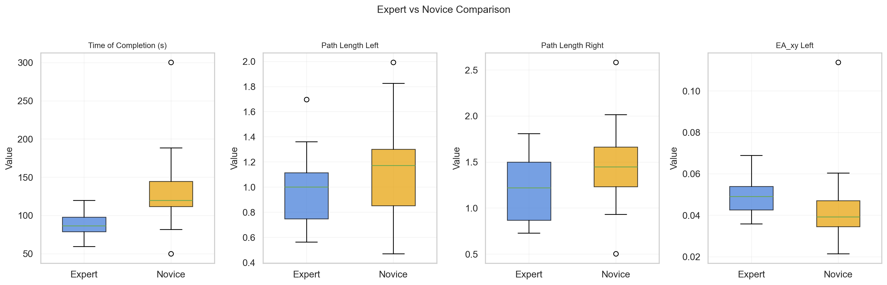 | 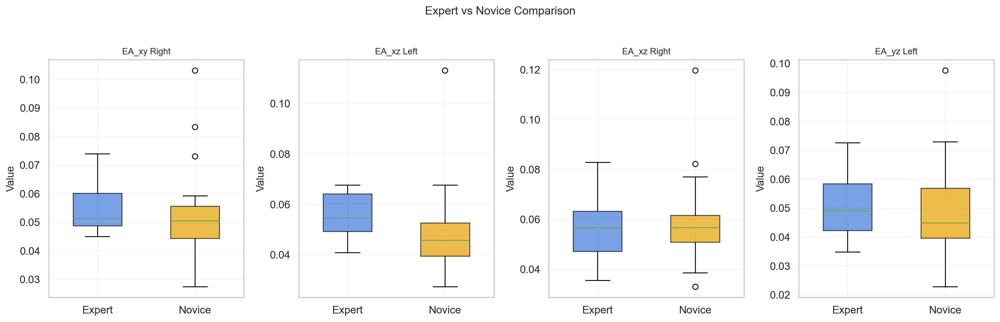 |
| 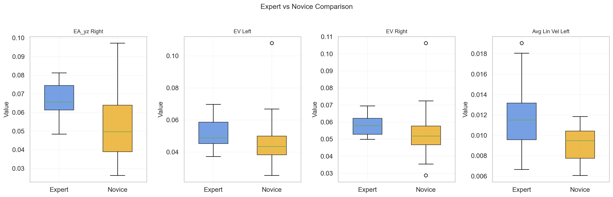 | 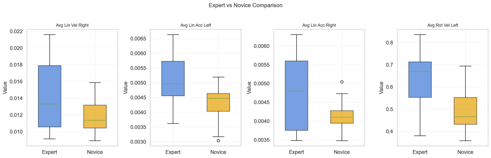 |
| 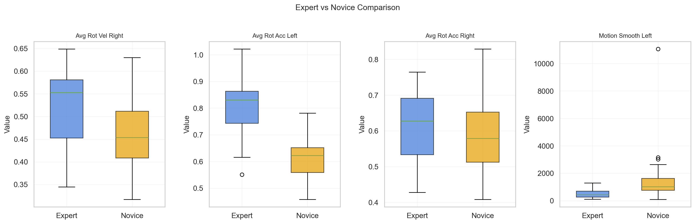 | 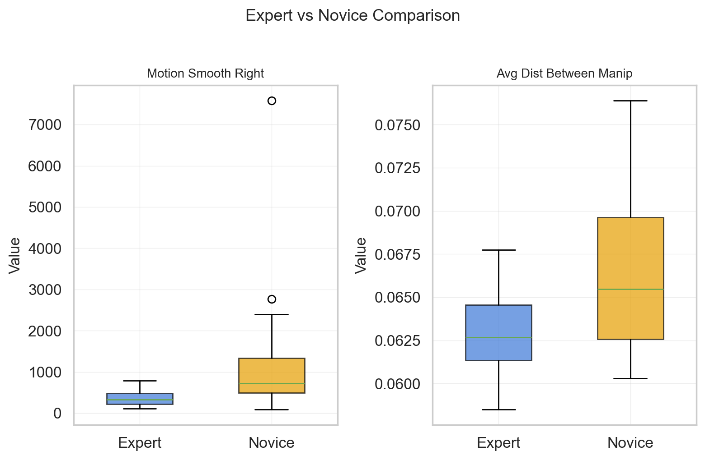 |

### 1.6 Statistical Testing - Mann-Whitney U

The Mann-Whitney U test (two-sided, $\alpha = 0.05$) was used to assess whether each parameter significantly differs between experts and novices. This non-parametric test is appropriate given the small sample sizes (20 per group) and no guarantee of normality.

<h4 align="center">Table 2: Mann-Whitney U Test Results (Expert vs Novice)</h4>

<div align="center">

| Parameter | Expert Mean | Novice Mean | U | p-value | Significant? |
|-----------|--------:|--------:|------:|--------:|:---:|
| Time of Completion (s) | 88.27 | 133.18 | 55.0 | 0.000093 | **Yes** |
| Path Length Left | 0.98 | 1.13 | 150.0 | 0.1806 | No |
| Path Length Right | 1.22 | 1.46 | 134.0 | 0.0764 | No |
| EA_xy Left | 0.049 | 0.044 | 289.0 | 0.0167 | **Yes** |
| EA_xy Right | 0.054 | 0.053 | 235.0 | 0.3507 | No |
| EA_xz Left | 0.055 | 0.049 | 283.0 | 0.0256 | **Yes** |
| EA_xz Right | 0.057 | 0.059 | 193.0 | 0.8604 | No |
| EA_yz Left | 0.051 | 0.049 | 226.0 | 0.4903 | No |
| EA_yz Right | 0.066 | 0.052 | 312.0 | 0.0026 | **Yes** |
| EV Left | 0.051 | 0.047 | 269.0 | 0.0639 | No |
| EV Right | 0.058 | 0.054 | 278.0 | 0.0360 | **Yes** |
| Avg Lin Vel Left | 0.012 | 0.009 | 302.0 | 0.0060 | **Yes** |
| Avg Lin Vel Right | 0.014 | 0.012 | 259.0 | 0.1136 | No |
| Avg Lin Acc Left | 0.005 | 0.004 | 307.0 | 0.0040 | **Yes** |
| Avg Lin Acc Right | 0.005 | 0.004 | 249.0 | 0.1895 | No |
| Avg Rot Vel Left | 0.631 | 0.485 | 335.0 | 0.000275 | **Yes** |
| Avg Rot Vel Right | 0.514 | 0.460 | 272.0 | 0.0531 | No |
| Avg Rot Acc Left | 0.803 | 0.613 | 356.0 | 0.000026 | **Yes** |
| Avg Rot Acc Right | 0.610 | 0.585 | 233.0 | 0.3793 | No |
| Motion Smooth Left | 507.45 | 1742.46 | 67.0 | 0.000338 | **Yes** |
| Motion Smooth Right | 364.98 | 1291.06 | 78.0 | 0.001014 | **Yes** |
| Avg Dist Between Manip | 0.063 | 0.067 | 113.0 | 0.0193 | **Yes** |

</div>

### 1.7 Interpretation

**12 of 22 parameters** significantly distinguish experts from novices (p < 0.05).

Time of Completion (p = 0.000093) is the strongest overall discriminator, confirming that experts complete the suturing task significantly faster than novices. This aligns with the expectation that experienced surgeons work more efficiently and make fewer errors requiring correction.

The economy metrics (EA_xy Left, EA_xz Left, EA_yz Right, EV Right) show that experts achieve higher economy values, meaning they cover the same workspace area with shorter, more direct path lengths. Rather than making excessive back-and-forth movements, expert surgeons take efficient trajectories to complete each suturing gesture.

Velocity and acceleration metrics (Avg Lin Vel Left, Avg Lin Acc Left, Avg Rot Vel Left, Avg Rot Acc Left) reveal that experts move faster and with greater rotational velocity and acceleration. Despite completing tasks in less time, their instruments are actively and purposefully engaged rather than idle - indicating confident, deliberate movements rather than tentative ones.

Motion Smoothness is the strongest per-manipulator discriminator, with both left (p = 0.000338) and right (p = 0.001014) reaching high significance. Novices exhibit 3-4 x higher normalised jerk than experts (e.g. 1742 vs 507 for the left manipulator). High jerk reflects frequent corrections and hesitation - abrupt changes in acceleration that occur when a surgeon pauses, reconsiders, or adjusts their approach mid-movement. Expert surgeons, by contrast, execute smooth, continuous motions that reflect practised motor control.

Average Distance Between Manipulators (p = 0.019) is also significant, with novices keeping the two tool tips slightly further apart on average. This may reflect novices being less comfortable bringing both instruments into close proximity to perform movements.

A notable pattern across the results is that **left manipulator (PSM1) metrics are consistently more discriminating than right manipulator (PSM2) metrics**. In the suturing task, one manipulator drives the needle through tissue (the active arm) while the other holds or positions the suture (the passive arm). The active arm's kinematics are far more sensitive to skill level - an expert's needle driving is smooth and efficient, whereas a novice's is hesitant and jerky. The passive arm performs more constrained movements that vary less between skill levels, explaining why the corresponding right-side metrics do not reach significance.

Finally, path length alone is not significant for either manipulator (left: p = 0.18, right: p = 0.08), despite being a component of the economy metrics that are significant. This suggests that the absolute distance travelled is less important than *how efficiently* that distance covers the workspace - i.e., economy captures this ratio, whereas path length in isolation does not account for workspace coverage.

---

## Question 2: JIGSAWS Classification [25 marks]

### 2.1 Feature Selection

From Q1's Mann-Whitney U analysis, 12 of 22 parameters significantly distinguish experts from novices (p < 0.05). These 12 were selected as the feature set for classification, reducing dimensionality from 22 to 12 features. With only 40 samples, reducing features helps mitigate the curse of dimensionality and reduces the risk of overfitting to noise from non-discriminative features.

The selected features are:

1. Time of Completion
2. EA_xy Left
3. EA_xz Left
4. EA_yz Right
5. EV Right
6. Avg Lin Vel Left
7. Avg Lin Acc Left
8. Avg Rot Vel Left
9. Avg Rot Acc Left
10. Motion Smooth Left
11. Motion Smooth Right
12. Avg Dist Between Manip

### 2.2 Feature Matrix

$$\mathbf{X} \in \mathbb{R}^{40 \times 12}, \quad \mathbf{y} \in \{0, 1\}^{40}$$

40 trials (8 participants x 5 trials), 12 features each. Labels: 1 = expert, 0 = novice. The dataset is balanced (20 expert, 20 novice).

### 2.3 Cross-Validation Scheme - LOSO

Leave-One-SuperTrial-Out (LOSO) cross-validation was used. Each fold holds out one trial number across all 8 participants:

| Fold | Test Set | Train Set |
|------|----------|-----------|
| 1 | Trial 1 from all 8 surgeons (8 samples) | Trials 2-5 (32 samples) |
| 2 | Trial 2 from all 8 surgeons (8 samples) | Trials 1, 3-5 (32 samples) |
| 3 | Trial 3 from all 8 surgeons (8 samples) | Trials 1-2, 4-5 (32 samples) |
| 4 | Trial 4 from all 8 surgeons (8 samples) | Trials 1-3, 5 (32 samples) |
| 5 | Trial 5 from all 8 surgeons (8 samples) | Trials 1-4 (32 samples) |

LOSO is preferred over random k-fold because trials from the same surgeon are correlated; each surgeon has a consistent movement "signature" across their 5 trials (speed, grip habits, trajectory patterns). If random k-fold placed surgeon C's trial 1 in training and trial 3 in test, the model could recognise C's personal style from the training data and classify based on individual identity rather than learning what generally distinguishes experts from novices. LOSO avoids this by ensuring every fold contains all 8 surgeons, forcing the model to learn patterns that generalise across repetitions rather than memorising surgeon-specific quirks.

### 2.4 Classifiers

**1. Bagging Decision Tree (Gini index)**

Bagging trains 50 decision trees on bootstrap samples and takes a majority vote. Each tree splits using Gini impurity:

$$G(S) = 1 - \sum_j p_j^2$$

No grid search is required; `n_estimators=50` is used directly.

**2. Random Forest (Entropy)**

Random Forest trains multiple trees, each using a random feature subset at every split. The split criterion is entropy:

$$H(S) = -\sum_j p_j \log_2(p_j)$$

The number of trees is optimised via grid search over `n_estimators` $\in$ {10, 25, 50, 100, 200}, using an inner 4-fold CV on the training set.

**3. K-Nearest Neighbours (KNN)**

KNN classifies by majority vote of the $k$ nearest training points:

$$\hat{y} = \text{mode}\left(\{y_i : \mathbf{x}_i \in N_k(\mathbf{x})\}\right)$$

Grid search optimises `n_neighbors` $\in$ {1, 3, 5, 7, 9} and `metric` $\in$ {euclidean, manhattan, minkowski}, using inner 4-fold CV.

Because KNN is distance-based, features are standardised using `StandardScaler` (mean=0, std=1), fitted on training data only to prevent data leakage. Tree-based methods do not require scaling as they split on individual feature thresholds.

### 2.5 Results

<h4 align="center">Table 3: Classification Results (LOSO CV)</h4>

<div align="center">

| Classifier | Precision | F1 Score | Accuracy |
|------------|--------:|--------:|--------:|
| Bagging DT (Gini) | 0.8571 | 0.8780 | 87.50% |
| Random Forest (Entropy) | 0.8261 | 0.8837 | 87.50% |
| **KNN** | **0.9048** | **0.9268** | **92.50%** |

</div>

### 2.6 Confusion Matrices

| Bagging DT (Gini) | Random Forest (Entropy) | KNN |
|:-:|:-:|:-:|
| 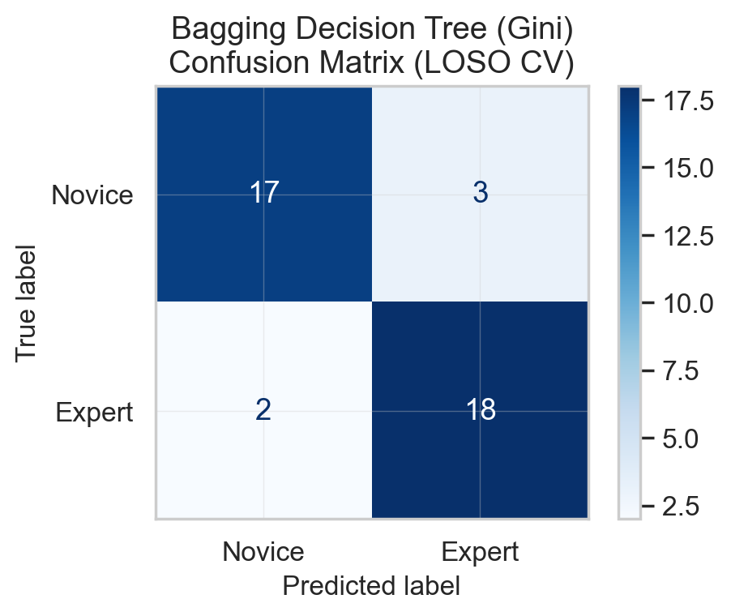 | 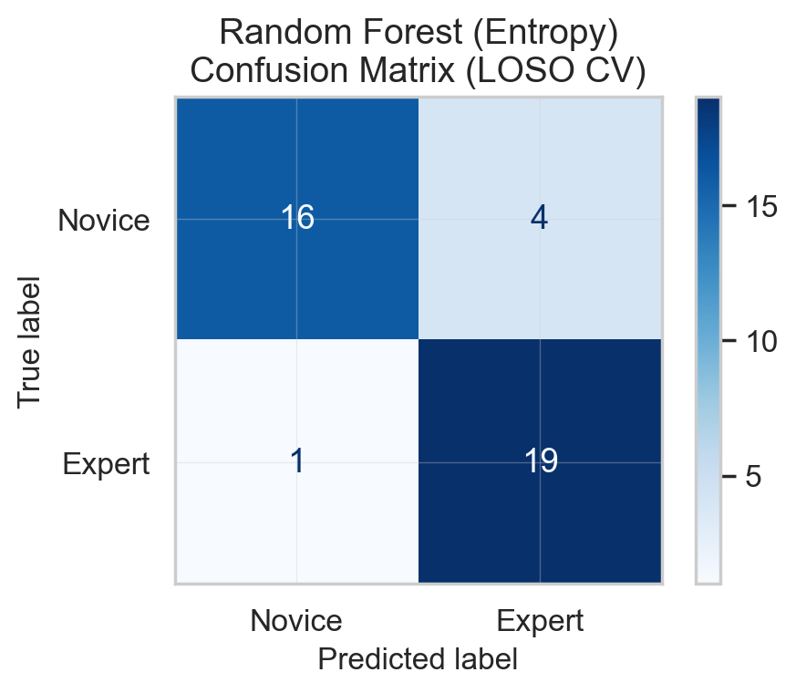 | 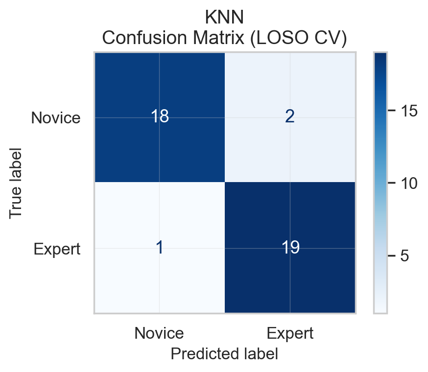 |

### 2.7 Grid Search Results

**Random Forest** - best `n_estimators` per LOSO fold:

| Fold 1 | Fold 2 | Fold 3 | Fold 4 | Fold 5 |
|:------:|:------:|:------:|:------:|:------:|
| 100 | 50 | 10 | 50 | 25 |

**KNN** - best hyperparameters per LOSO fold:

| Fold | k | Metric |
|:----:|:-:|:------:|
| 1 | 9 | euclidean |
| 2 | 9 | euclidean |
| 3 | 3 | manhattan |
| 4 | 3 | euclidean |
| 5 | 9 | manhattan |

### 2.8 Interpretation

KNN achieves the best performance with 92.5% accuracy (F1 = 0.927), misclassifying only 3 of 40 trials. The two tree-based methods both achieve 87.5% accuracy but differ in their error profiles: Bagging DT produces more balanced errors (3 false positives, 2 false negatives), while Random Forest is more conservative with expert predictions (4 false positives, 1 false negative). However, these error profiles are similar enough that it is not a significant enough 'issue'/talking point.

KNN's  performance on this dataset can be expected. The 12 features were specifically selected in Q1 for their ability to distinguish experts from novices, meaning the expert and novice groups form compact, well-separated clusters in the resulting 12-dimensional feature space. KNN excels in exactly this scenario; it relies on local neighbourhood structure and benefits directly from clean, low-dimensional data where class boundaries are clear. Tree-based methods are better suited to higher-dimensional, noisier problems where non-linear feature interactions matter, but with only 40 samples they are more susceptible to overfitting despite the variance reduction from bagging and ensembling.

Feature scaling is required for KNN's. Without StandardScaler, features with large ranges (e.g. Motion Smoothness, ranging ~500-1700) would completely dominate the distance calculation, making small-range features (e.g. Economy of Area, ranging ~0.03-0.07) effectively invisible. Standardising to mean=0, std=1 ensures all features contribute equally. The scaler is fitted on training data only within each fold to prevent data leakage - if test-set statistics influenced the scaling, the model would indirectly have access to information it should not see during training.

The variation in optimal hyperparameters across LOSO folds is notable: KNN selects k=3 for some folds and k=9 for others, while Random Forest's optimal number of trees ranges from 10 to 100. This instability reflects the small dataset size - with only 32 training samples per fold, the optimal decision boundary is sensitive to which 8 samples are held out. This underscores the importance of both the LOSO scheme and the inner cross-validation for hyperparameter tuning, as a single fixed set of hyperparameters would be suboptimal for at least some folds.

All three classifiers perform well above the 50% chance level, confirming that the 12 selected features carry genuine capacity for distinguishing expert and novice surgeons from each other.

---

## Question 3: COVID CT Classification with LDA/QDA [10 marks]

### 3.1 Dataset Overview

The COVID-CT dataset contains chest CT scan images from two classes:

- **COVID-positive:** 349 images (sourced from 216 patients)
- **Non-COVID:** 397 images

All images are resized to 120x120 pixels and converted to grayscale, yielding a feature vector of length 14,400 per image when flattened.

<h4 align="center">Figure 7: Sample CT Images</h4>

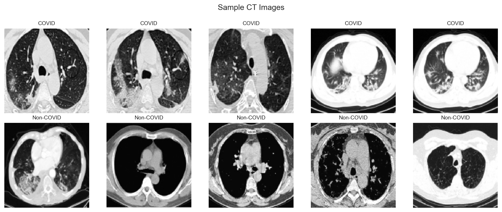

The sample images provided show some of the difficulty in this task; COVID and Non-COVID CT scans share similar overall structure. 

### 3.2 Classifiers

**Linear Discriminant Analysis (LDA)**

LDA assumes each class follows a Gaussian distribution with a shared covariance matrix $\boldsymbol{\Sigma}$. The discriminant function for class $k$ is:

$$\delta_k(\mathbf{x}) = \mathbf{x}^T \boldsymbol{\Sigma}^{-1} \boldsymbol{\mu}_k - \frac{1}{2} \boldsymbol{\mu}_k^T \boldsymbol{\Sigma}^{-1} \boldsymbol{\mu}_k + \ln(\pi_k)$$

The shared covariance assumption produces a **linear** decision boundary.

**Quadratic Discriminant Analysis (QDA)**

QDA allows each class to have its own covariance matrix $\boldsymbol{\Sigma}_k$:

$$\delta_k(\mathbf{x}) = -\frac{1}{2} \ln|\boldsymbol{\Sigma}_k| - \frac{1}{2} (\mathbf{x} - \boldsymbol{\mu}_k)^T \boldsymbol{\Sigma}_k^{-1} (\mathbf{x} - \boldsymbol{\mu}_k) + \ln(\pi_k)$$

This produces a **quadratic** decision boundary, which can capture more complex class separations.

**The singularity problem:** QDA must estimate a separate covariance matrix $\boldsymbol{\Sigma}_k$ for each class. With 14,400 features, each covariance matrix is $14{,}400 \times 14{,}400$ - over 207 million parameters per class. With only ~300 training samples per class per fold, the system is massively underdetermined: there are far more unknowns than data points. The resulting covariance matrices are **singular** (rank-deficient, not invertible), making the discriminant function $\delta_k(\mathbf{x})$ impossible to compute.

LDA avoids this because it pools all training samples into a single shared covariance matrix and sklearn's implementation uses a pseudoinverse internally. QDA cannot pool, therefore, each class needs its own matrix.

**Solution:** PCA is applied first to reduce dimensionality from 14,400 to 100 components. QDA then estimates 100x100 covariance matrices (~5,000 parameters per class), which is feasible with ~300 samples. A regularisation parameter (`reg_param=0.5`) further stabilises estimation by shrinking each $\boldsymbol{\Sigma}_k$ toward a diagonal matrix.

### 3.3 Validation

5-fold stratified cross-validation was used, with stratification ensuring proportional class representation in each fold (~150 images per validation fold).

### 3.4 Results

<h4 align="center">Table 4: LDA/QDA Classification Results (5-fold CV)</h4>

<div align="center">

| Classifier | Precision | F1 Score | Accuracy |
|------------|--------:|--------:|--------:|
| LDA | 0.6934 | 0.6934 | 71.31% |
| QDA (PCA 100 + reg=0.5) | 0.7631 | 0.7781 | 78.82% |

</div>

### 3.5 Confusion Matrices

| LDA | QDA |
|:-:|:-:|
| 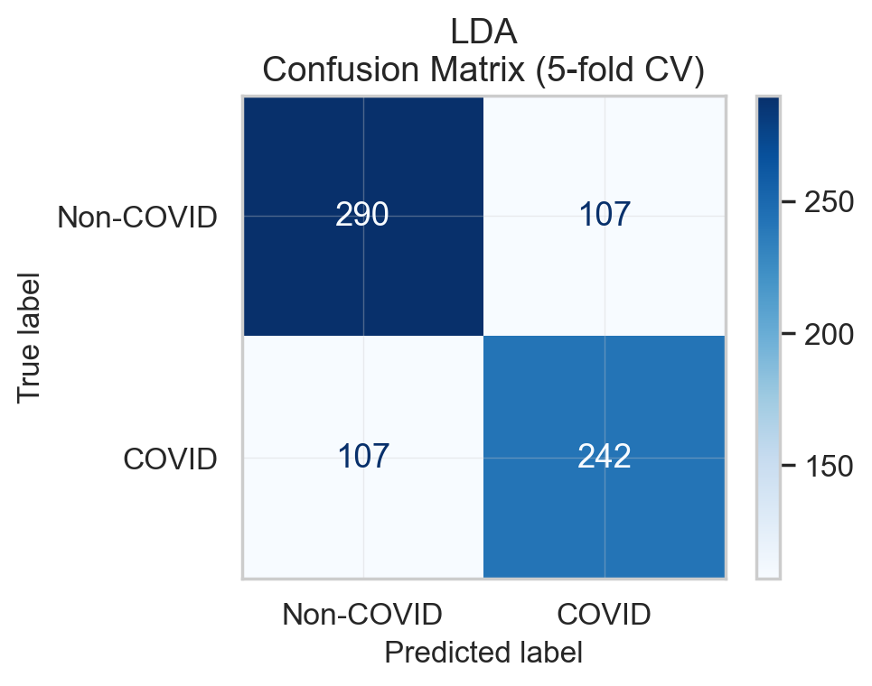 | 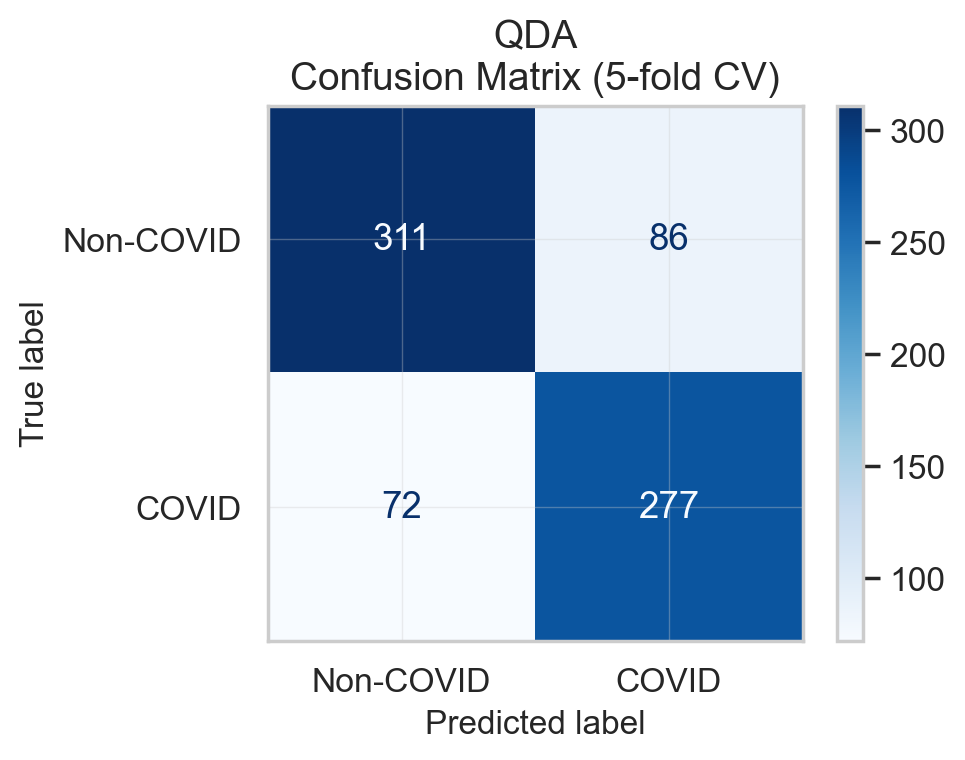 |

### 3.6 Interpretation

QDA outperforms LDA (78.8% vs 71.3%). This improvement is expected: COVID and Non-COVID CT images differ not only in their average pixel intensities but in how those intensities vary across the image. QDA captures this by fitting a separate covariance matrix to each class, producing a curved (quadratic) decision boundary that can model these non-linear differences. LDA's shared covariance assumption forces a linear boundary that cannot account for class-specific variance structure.

LDA's identical precision and F1 score (0.693) indicate a symmetric error profile - it misclassifies an equal number of COVID and Non-COVID images (107 each), suggesting the linear boundary sits roughly equidistant between the two class centres without favouring either. QDA shows improvement in both directions but particularly reduces false negatives, with COVID misclassifications dropping from 107 to 72. This means QDA correctly identifies more COVID-positive cases, which is clinically important in a diagnostic context.

It is worth noting that QDA required PCA dimensionality reduction (14,400 to 100 features) before it could be applied. QDA must estimate a separate $14{,}400 \times 14{,}400$ covariance matrix per class - over 207 million parameters - from only ~300 training samples per class. This is therefore underdetermined, resulting in singular (non-invertible) matrices. PCA reduces the feature space to 100 components, making the $100 \times 100$ covariance matrices (~5,000 parameters) which is significantly lower and therefore feesible to estimate from ~300 samples. LDA avoids this issue entirely because it pools all training samples into a single shared covariance matrix and uses a pseudoinverse internally.

Both classifiers are fundamentally limited by their use of raw flattened pixel values as features. When a 120x120 image is flattened to a 14,400-length vector, all spatial structure is lost; pixel (50, 50) and its immediate neighbour (50, 51) are effectively two unrelated numbers. Local patterns are inherently spatial and cannot be captured by treating each pixel independently. This motivates the use of Histogram of Oriented Gradients (HOG) features in Q4, which explicitly encode local edge and texture structure by computing gradient orientation histograms within 8x8 pixel cells.

---

## Question 4: COVID CT Classification with SVM + HOG [25 marks]

### 4.1 HOG Feature Extraction

Histogram of Oriented Gradients (HOG) captures the distribution of gradient directions in local image patches, encoding edge and texture information in a compact feature vector:

1. Compute image gradients $G_x, G_y$ via convolution with $[-1, 0, 1]$ filters
2. Compute gradient magnitude and orientation at each pixel:

$$M(x,y) = \sqrt{G_x^2 + G_y^2}, \quad \theta(x,y) = \arctan\left(\frac{G_y}{G_x}\right)$$

3. Divide the image into cells of 8x8 pixels
4. For each cell, build a histogram of gradient orientations (9 bins, 0 degrees-180 degrees) weighted by gradient magnitude
5. Normalise histograms across blocks of 3x3 cells using L2-Hys norm
6. Concatenate all block-normalised histograms into a single feature vector

For our 120x120 images this produces a feature vector of length **13,689** - comparable in dimensionality to the raw pixel representation (14,400) but encoding spatial edge structure rather than raw intensities.

HOG is well-suited to CT images because COVID-specific features (ground-glass opacities, consolidations, lung boundary irregularities) manifest as distinctive local edge patterns that HOG captures directly.

### 4.2 Support Vector Machine (SVM)

SVM finds the hyperplane that maximises the margin between classes.

**Linear kernel** - the optimisation problem:

$$\min_{\mathbf{w}, b, \boldsymbol{\xi}} \frac{1}{2}\|\mathbf{w}\|^2 + C \sum_i \xi_i \quad \text{s.t.} \quad y_i(\mathbf{w} \cdot \mathbf{x}_i + b) \geq 1 - \xi_i, \quad \xi_i \geq 0$$

where $C$ controls the trade-off between margin width and misclassification tolerance.

**RBF kernel** - maps data into a higher-dimensional space via the kernel function:

$$K(\mathbf{x}_i, \mathbf{x}_j) = \exp\left(-\gamma \|\mathbf{x}_i - \mathbf{x}_j\|^2\right)$$

where $\gamma$ controls the "reach" of each support vector. Large $\gamma$ produces complex boundaries (risk of overfitting); small $\gamma$ produces smooth boundaries (risk of underfitting).

### 4.3 Grid Search

Hyperparameters were optimised via grid search with inner 4-fold CV on each training fold:

- $C \in \{0.01, 0.1, 1, 10, 100\}$
- $\gamma \in \{0.0001, 0.001, 0.01, 0.1, 1\}$ (RBF only)

**SVM Linear** - best $C$ per fold:

| Fold 1 | Fold 2 | Fold 3 | Fold 4 | Fold 5 |
|:------:|:------:|:------:|:------:|:------:|
| 0.01 | 0.1 | 0.1 | 0.1 | 1 |

**SVM RBF** - best $(C, \gamma)$ per fold:

| Fold | C | $\gamma$ |
|:----:|:-:|:--------:|
| 1 | 10 | 0.01 |
| 2 | 10 | 0.01 |
| 3 | 10 | 0.01 |
| 4 | 10 | 0.001 |
| 5 | 10 | 0.01 |

The RBF kernel consistently selects $C = 10$ and $\gamma \approx 0.01$, indicating a stable optimum. The linear kernel shows more variation in $C$, suggesting the linear decision boundary is more sensitive to the specific fold composition.

### 4.4 Results

<h4 align="center">Table 5: SVM + HOG Classification Results (5-fold CV)</h4>

<div align="center">

| Classifier | Precision | F1 Score | Accuracy |
|------------|--------:|--------:|--------:|
| SVM Linear | 0.7549 | 0.7614 | 77.48% |
| SVM RBF | 0.8136 | 0.8006 | 81.64% |

</div>

### 4.5 Confusion Matrices

| SVM Linear | SVM RBF |
|:-:|:-:|
| 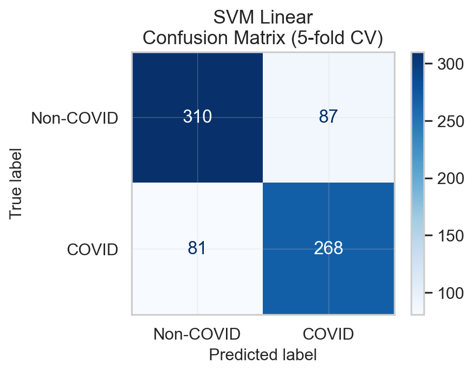 | 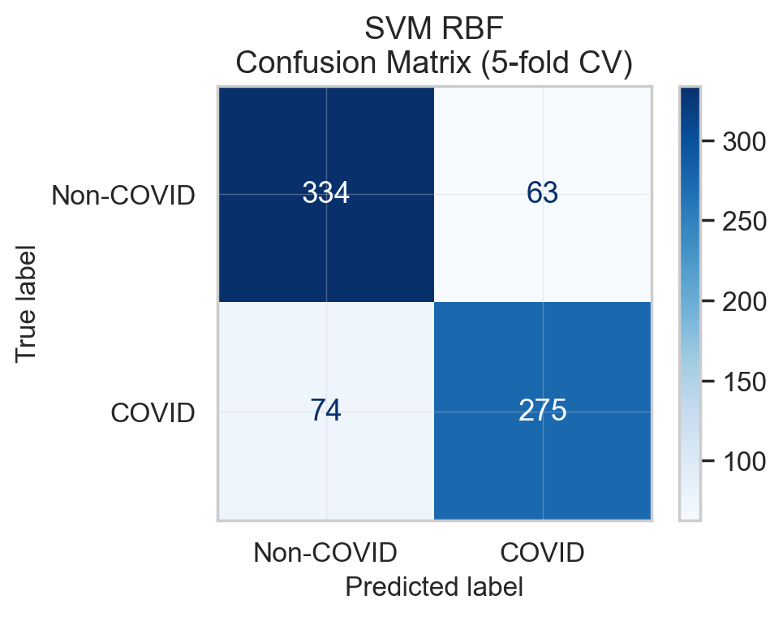 |

### 4.6 Comparison with Q3 (LDA/QDA)

<h4 align="center">Table 6: Full Comparison - Q3 vs Q4</h4>

<div align="center">

| Classifier | Features | Precision | F1 Score | Accuracy |
|------------|----------|--------:|--------:|--------:|
| LDA (Q3) | Raw pixels | 0.6934 | 0.6934 | 71.31% |
| QDA (Q3) | PCA-100 pixels | 0.7631 | 0.7781 | 78.82% |
| SVM Linear (Q4) | HOG | 0.7549 | 0.7614 | 77.48% |
| **SVM RBF (Q4)** | **HOG** | **0.8136** | **0.8006** | **81.64%** |

</div>

SVM RBF with HOG features achieves the best performance across all metrics (81.6% accuracy, precision = 0.814, F1 = 0.801). This improvement over the Q3 classifiers reflects two factors working together: HOG features capturing local edge and texture structure that raw pixel values miss, and the RBF kernel which can model non-linear decision boundaries that LDA's single linear hyperplane cannot.

ABetween SVM Linear (77.5%) and QDA from Q3 (78.8%), despite using the HOG features, SVM Linear slightly underperforms QDA on PCA-reduced raw pixels. This demonstrates that good features alone are not sufficient - the decision boundary must also be sufficiently complex to exploit the feature representation. QDA achieves comparable performance through a different mechanism: it uses a quadratic boundary on simpler features, while SVM Linear uses a linear boundary on richer features. Both approaches capture some degree of non-linearity, but through different means (decision boundary complexity vs feature space quality). The best result combines both: HOG features with a non-linear RBF kernel.

The grid search results show that SVM RBF consistently selects $C = 10$ and $\gamma = 0.01$ across most folds, indicating a stable optimum in the hyperparameter space. SVM Linear shows more variation in the optimal $C$ value (0.01 to 1 across folds), suggesting the linear decision boundary is more sensitive to the specific fold composition.

### 4.7 Comparison with Published Literature

<h4 align="center">Table 7: Comparison with Published Results on COVID-CT Dataset</h4>

<div align="center">

| Method | F1 Score | Accuracy |
|--------|--------:|--------:|
| Our SVM RBF + HOG | 0.80 | 81.6% |
| He et al. [1] - Self-Trans (DenseNet-169) | 0.85 | 86% |
| Yang et al. [2] - TL + CSSL + Masks (DenseNet-169) | 0.90 | 89.1% |

</div>

Our SVM RBF + HOG achieves 81.6% accuracy, compared to 86% reported by He et al. [1] and 89.1% by Yang et al. [2]. The gap of 4-8 percentage points is substantial but expected given the fundamental differences in approach.

**This is not a fair comparison**, for several reasons. First, both published methods use deep convolutional neural networks (DenseNet-169 with approximately 14 million parameters) that learn hierarchical feature representations directly from the data, whereas our SVM uses hand-crafted HOG features with a fixed extraction pipeline and no learned representations. Second, both papers employ transfer learning from ImageNet (millions of natural images) and contrastive self-supervised learning on additional lung CT datasets (LUNA), effectively leveraging orders of magnitude more training data than our method, which uses no external data whatsoever. Third, Yang et al. incorporate lung segmentation masks and lesion masks as auxiliary supervision, providing the model with explicit spatial guidance about disease-relevant regions that our method has no access to. Fourth, the evaluation protocols differ: our 5-fold CV evaluates across the entire dataset, while the published results use specific train/validation/test splits with data augmentation, making direct numerical comparison imprecise. Fifth, HOG is a generic, hand-designed descriptor that captures gradient orientations in fixed 8x8 pixel cells, whereas CNNs learn task-specific features at multiple scales from low-level edges to high-level semantic patterns.

Given these differences, achieving 81.6% accuracy with a classical machine learning pipeline on the same dataset where deep learning methods achieve 86-89% is a reasonable result.

---

## Question 5: Imbalanced COVID CT Classification [25 marks]

### 5.1 Imbalanced Dataset

The last 200 Non-COVID images are removed, creating an imbalanced dataset:

- **COVID-positive:** 349 images (majority class)
- **Non-COVID:** 197 images (minority class)
- **Imbalance ratio:** 1.77:1
- **Fold size:** 5-fold CV on 546 images yields ~109 validation images per fold (not 150 as in Q3/Q4, since the reduced dataset makes 5 x 150 = 750 > 546 impossible without overlapping folds)

### 5.2 Method to Mitigate Imbalance - `class_weight='balanced'`

The standard SVM loss treats all misclassifications equally:

$$\mathcal{L} = C \sum_i \xi_i$$

With `class_weight='balanced'`, the loss is reweighted per class:

$$\mathcal{L} = \sum_i C_i \cdot \xi_i \quad \text{where} \quad C_i = C \times \frac{N}{2 \times N_{\text{class}_i}}$$

For our data ($N = 546$):

$$C_{\text{COVID}} = C \times \frac{546}{2 \times 349} = C \times 0.782$$

$$C_{\text{Non-COVID}} = C \times \frac{546}{2 \times 197} = C \times 1.386$$

This makes misclassifying a Non-COVID image ~1.77x more costly than misclassifying a COVID image.

### 5.3 Results - Before Mitigation (Imbalanced)

<h4 align="center">Table 8: SVM on Imbalanced Data - No Correction</h4>

<div align="center">

| Classifier | Precision | F1 Score | Accuracy | Recall COVID | Recall Non-COVID |
|------------|--------:|--------:|--------:|--------:|--------:|
| SVM Linear | 0.808 | 0.866 | 81.5% | 0.931 | 0.609 |
| SVM RBF | 0.824 | 0.877 | 83.2% | 0.937 | 0.645 |

</div>

### 5.4 Results - After Mitigation (Balanced Weights)

<h4 align="center">Table 9: SVM on Imbalanced Data - With class_weight='balanced'</h4>

<div align="center">

| Classifier | Precision | F1 Score | Accuracy | Recall COVID | Recall Non-COVID |
|------------|--------:|--------:|--------:|--------:|--------:|
| SVM Linear (balanced) | 0.830 | 0.840 | 79.3% | 0.851 | 0.690 |
| SVM RBF (balanced) | 0.841 | 0.875 | 83.3% | 0.911 | 0.695 |

</div>

### 5.5 Confusion Matrices

| SVM Linear (imbalanced) | SVM RBF (imbalanced) |
|:-:|:-:|
| 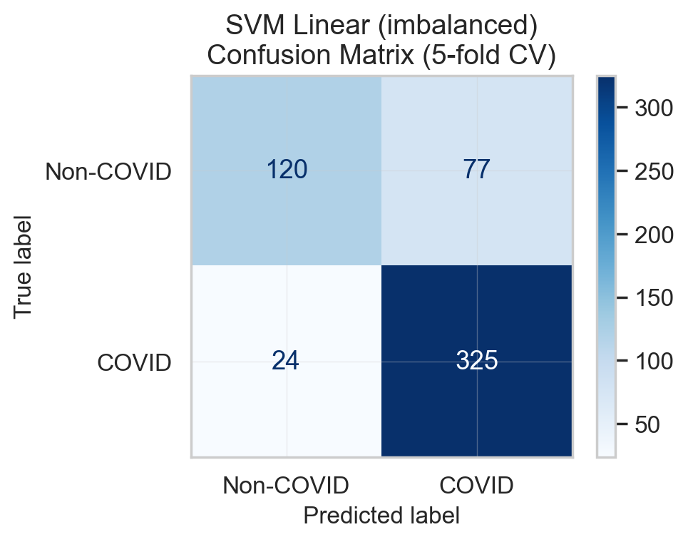 |  |

| SVM Linear (balanced weights) | SVM RBF (balanced weights) |
|:-:|:-:|
| 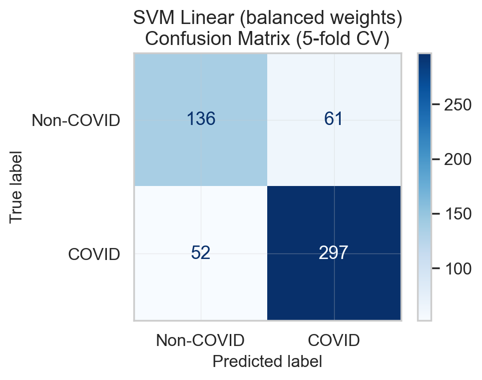 |  |

### 5.6 Full Comparison - Q4 (Balanced Data) vs Q5 (Imbalanced Data)

<h4 align="center">Table 10: SVM RBF Across All Settings</h4>

<div align="center">

| Setting | Precision | F1 Score | Accuracy | Recall COVID | Recall Non-COVID |
|---------|--------:|--------:|--------:|--------:|--------:|
| Q4 - Balanced data (349 vs 397) | 0.814 | 0.801 | 81.6% | - | - |
| Q5 - Imbalanced, no correction | 0.824 | 0.877 | 83.2% | 0.937 | 0.645 |
| Q5 - Imbalanced, balanced weights | 0.841 | 0.875 | 83.3% | 0.911 | 0.695 |

</div>

### 5.7 Interpretation

**Effect of imbalance.** Without any correction, the SVM RBF classifier biases heavily toward the majority class (COVID), achieving 93.7% recall for COVID but only 64.5% for Non-COVID - meaning over a third of Non-COVID images are misclassified as COVID. The overall accuracy of 83.2% appears respectable, but this is misleading: a naive classifier that always predicts "COVID" would achieve 349/546 = 63.9% accuracy without learning anything. The model does better than chance, but at the cost of severely neglecting the minority class. The F1 score of 0.877 also appears high, but this is because F1 is computed for the positive class (COVID), which is the majority class in this imbalanced setting and does not reflect the poor Non-COVID performance.

**Effect of balancing.** Applying `class_weight='balanced'` improves Non-COVID recall from 64.5% to 69.5% for SVM RBF, meaning the classifier now correctly identifies approximately 5% more Non-COVID cases. This comes at a modest trade-off: COVID recall decreases slightly from 93.7% to 91.1%, as the shifted decision boundary produces slightly more false negatives for the majority class. Overall accuracy is essentially unchanged (83.2% to 83.3%), demonstrating that the balancing redistributes errors between classes rather than reducing the total number of errors. Precision also improves from 0.824 to 0.841, indicating fewer false positives (Non-COVID images incorrectly predicted as COVID).

**Method justification.** The `class_weight='balanced'` approach was chosen because it directly addresses the source of the bias - the loss function - without modifying the training data. It is built into sklearn's SVM implementation, requires no additional dependencies, and does not generate synthetic data. Alternative methods were considered: SMOTE (Synthetic Minority Oversampling Technique) generates synthetic minority samples by interpolating between existing ones, but in a high-dimensional HOG feature space this can produce unrealistic feature vectors that do not correspond to plausible CT images. Random oversampling duplicates existing minority samples, risking overfitting to specific examples. Random undersampling discards majority class data, wasting information. Adjusting the class weights avoids all of these issues and is well-suited to the moderate imbalance ratio (1.77:1) in this dataset.

**How successful was the mitigation?** Partially. Non-COVID recall improved by approximately 5 percentage points, but at 69.5% it remains mediocre, nearly a third of Non-COVID images are still misclassified. The moderate imbalance ratio (1.77:1) limits the magnitude of the correction; a more severe imbalance (e.g. 10:1) would produce a larger and more visible effect from the same technique. The residual performance gap reflects genuine classification difficulty. Non-COVID CT images are inherently harder to distinguish from COVID images, rather than class imbalance alone.

**Comparison with Q4 (balanced data).** The Q4 balanced-data SVM RBF achieved 81.6% accuracy with roughly equal class representation (349 vs 397). The Q5 imbalanced SVM RBF achieves a slightly higher overall accuracy of 83.2%, but this is an artifact of the majority class dominating the accuracy metric. Per-class recall reveals the true picture: the imbalanced model's 93.7% vs 64.5% recall split is far less equitable than the balanced-data model's performance. Applying balanced weights restores a more equitable recall distribution (91.1% vs 69.5%) without sacrificing overall accuracy, confirming that the class weighting approach successfully mitigates the worst effects of the imbalance while acknowledging that it cannot fully compensate for the underlying classification difficulty.
