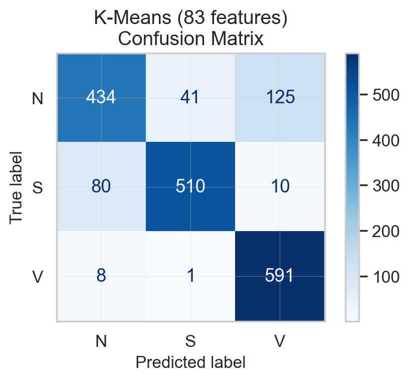
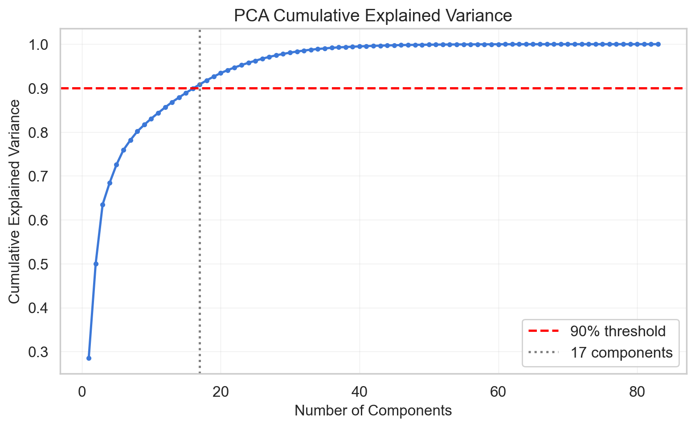
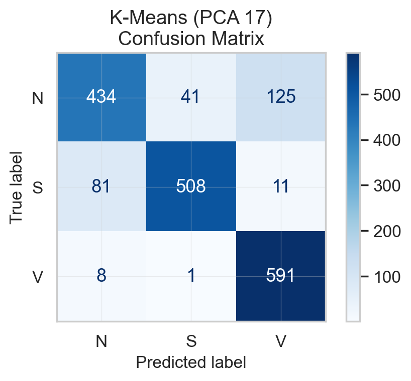
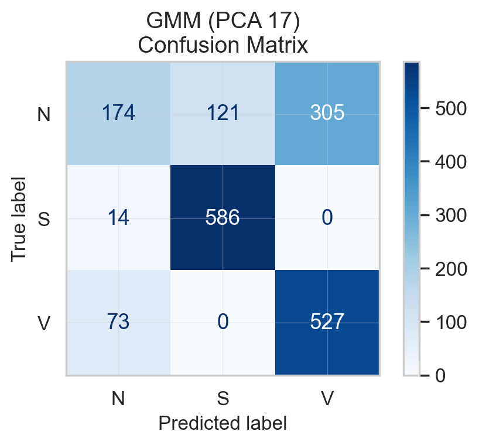
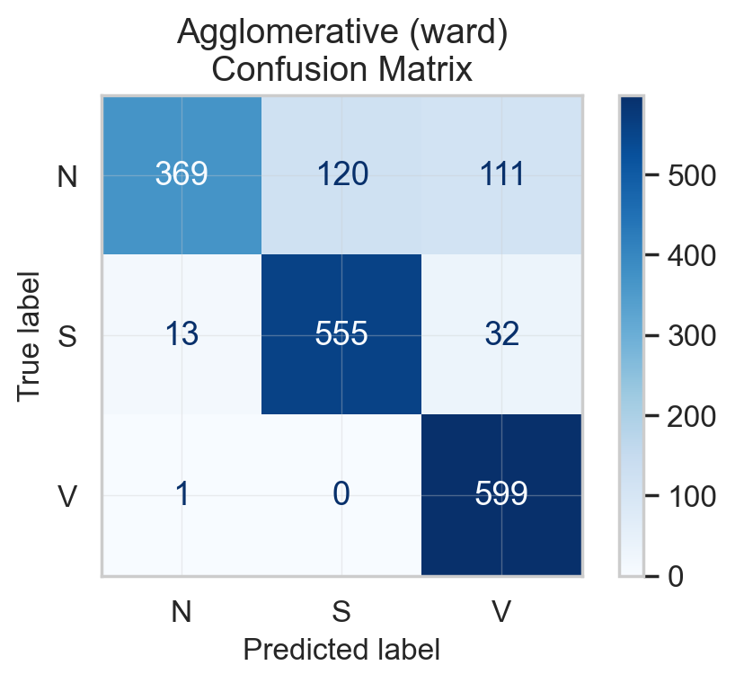
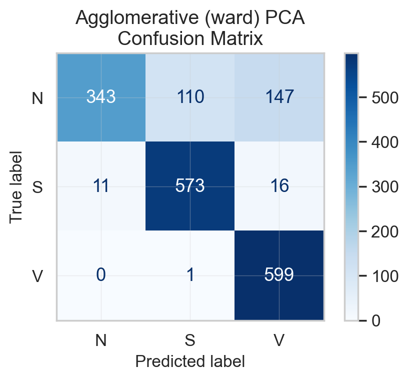

# MPHY0047 Coursework 4 - Report

## How to Run

```bash
python question1.py  # K-Means clustering (Q1)
python question2.py  # GMM-EM clustering (Q2)
python question3.py  # Agglomerative clustering + comparison (Q3)
python question4.py  # Time series forecasting (Q4)
python question5.py  # Association rule mining (Q5)
```

---

## Question 1: K-Means Clustering [20 marks]

### 1.1 Dataset

The ECG dataset contains 1800 heartbeats (600 per class) from the MIT-BIH Arrhythmia Database, representing three AAMI beat types:

- **N (Normal)**: 600 beats - regular sinus rhythm
- **S (Supraventricular)**: 600 beats - premature atrial/junctional beats
- **V (Ventricular)**: 600 beats - premature ventricular contractions

Each heartbeat is described by 83 features extracted via Daubechies-4 (db4) wavelet decomposition at 6 levels. The features include the mean, standard deviation, median, skewness, kurtosis, RMS, and ratio of the approximate and detail wavelet coefficients at each decomposition level.

### 1.2 Feature Scaling

Features were standardised using StandardScaler (mean=0, std=1) before clustering. This is necessary because the 83 wavelet features have vastly different scales - the largest feature standard deviation is over 44,000x the smallest. K-Means uses Euclidean distance to assign points to clusters:

$$d(\mathbf{x}, \boldsymbol{\mu}_k) = \sqrt{\sum_{j=1}^{p} (x_j - \mu_{kj})^2}$$

Without scaling, features with large ranges dominate this distance calculation and features with small ranges are effectively invisible. StandardScaler ensures all features contribute equally.

### 1.3 K-Means Algorithm

K-Means partitions data into $k$ clusters by minimising the within-cluster sum of squares:

$$\arg\min_{\mathbf{S}} \sum_{k=1}^{K} \sum_{\mathbf{x} \in S_k} \|\mathbf{x} - \boldsymbol{\mu}_k\|^2$$

The algorithm alternates between:
1. **Assignment**: assign each point to the nearest centroid
2. **Update**: recompute each centroid as the mean of its assigned points

Parameters: $k=3$, `random_state=4`, `n_init=10` (10 random initialisations, best result kept).

### 1.4 Label Re-assignment

K-Means is unsupervised - it has no access to true labels. The cluster IDs (0, 1, 2) are arbitrary and will not generally match the true class labels (N=0, S=1, V=2). Before computing evaluation metrics, we must find the optimal mapping from cluster IDs to true class labels.

The Hungarian algorithm (`scipy.optimize.linear_sum_assignment`) is used to find the one-to-one mapping that maximises total correct assignments. This is applied to the confusion matrix between true labels and raw cluster labels.

For our K-Means results:
- Raw cluster accuracy (before alignment): **0.2472** - effectively random
- Aligned accuracy (after reassignment): **0.8528** - the true clustering performance

### 1.5 Results - All 83 Features

<h4 align="center">Table 1: K-Means Clustering Results (83 Features, Scaled)</h4>

<div align="center">

| Metric | Value |
|--------|------:|
| Accuracy | 0.8528 |
| Precision (weighted) | 0.8565 |
| Recall (weighted) | 0.8528 |
| F1 Score (weighted) | 0.8501 |

</div>

<h4 align="center">Figure 1: K-Means Confusion Matrix (83 Features)</h4>



**Per-class breakdown:**
- **V (Ventricular)**: 591/600 correct (98.5% recall) - easiest to cluster
- **S (Supraventricular)**: 510/600 correct (85.0% recall)
- **N (Normal)**: 434/600 correct (72.3% recall) - hardest to cluster, confused with both S (41) and V (125)

### 1.6 PCA Dimensionality Reduction

Principal Component Analysis was applied to the scaled features to reduce dimensionality while maintaining >90% of the cumulative explained variance. **17 components** were retained, capturing **90.85%** of the total variance - a reduction from 83 to 17 features (80% fewer dimensions).

<h4 align="center">Figure 2: PCA Cumulative Explained Variance</h4>



### 1.7 Results - PCA-Reduced Features

<h4 align="center">Table 2: K-Means Clustering Results (PCA 17 Components)</h4>

<div align="center">

| Metric | 83 Features | PCA (17) | Difference |
|--------|--------:|--------:|--------:|
| Accuracy | 0.8528 | 0.8517 | -0.0011 |
| Precision | 0.8565 | 0.8555 | -0.0010 |
| Recall | 0.8528 | 0.8517 | -0.0011 |
| F1 Score | 0.8501 | 0.8490 | -0.0011 |

</div>

<h4 align="center">Figure 3: K-Means Confusion Matrix (PCA 17 Components)</h4>



### 1.8 Interpretation

**Key talking points:**

- PCA reduces 83 features to 17 with virtually no performance loss (accuracy drops by 0.1pp) - this means 66 of the 83 wavelet features are redundant for clustering purposes; the discriminative information is concentrated in a small number of principal components
- V beats are easiest to cluster (98.5% recall) - ventricular premature contractions have a distinctive wide QRS complex morphology that creates clearly different wavelet coefficients compared to N and S beats
- N beats are hardest to cluster (72.3% recall) - normal beats represent the "baseline" morphology; some normal beats have wavelet features that overlap with the S and V distributions, particularly the 125 N beats misclassified as V
- S beats have moderate clustering accuracy (85%) - supraventricular beats have subtle timing and morphology differences from normal beats that the wavelet features partially capture
- The class imbalance in errors is notable: N loses 166 beats to misclassification while V loses only 9 - this asymmetry suggests the V cluster is compact and well-separated while the N cluster is more diffuse in feature space

---

## Question 2: Gaussian Mixture Model Clustering [20 marks]

### 2.1 GMM-EM Algorithm

Gaussian Mixture Models assume the data is generated by a mixture of $K$ Gaussian distributions. Each cluster $k$ is characterised by:
- Mean $\boldsymbol{\mu}_k$ (centre)
- Covariance matrix $\boldsymbol{\Sigma}_k$ (shape)
- Mixing weight $\pi_k$ (proportion of data)

The model assigns each point a probability of belonging to each cluster:

$$P(k | \mathbf{x}_i) = \frac{\pi_k \cdot \mathcal{N}(\mathbf{x}_i | \boldsymbol{\mu}_k, \boldsymbol{\Sigma}_k)}{\sum_{j=1}^{K} \pi_j \cdot \mathcal{N}(\mathbf{x}_i | \boldsymbol{\mu}_j, \boldsymbol{\Sigma}_j)}$$

The parameters are fitted using the Expectation-Maximisation (EM) algorithm:
1. **E-step**: compute the probability each point belongs to each cluster (using current parameters)
2. **M-step**: update means, covariances, and weights to maximise likelihood (using current probabilities)

Parameters: $K=3$, `random_state=9`.

**Key difference from K-Means**: K-Means assumes spherical clusters (equal variance in all directions) and makes hard assignments. GMM estimates per-cluster covariance matrices, allowing elliptical/elongated clusters, and assigns soft (probabilistic) memberships. If the ECG beat classes have different shapes in feature space, GMM should capture this better.

### 2.2 Results - All 83 Features

<h4 align="center">Table 3: GMM Clustering Results (83 Features, Scaled)</h4>

<div align="center">

| Metric | Value |
|--------|------:|
| Accuracy | 0.8678 |
| Precision (weighted) | 0.8725 |
| Recall (weighted) | 0.8678 |
| F1 Score (weighted) | 0.8647 |

</div>

<h4 align="center">Figure 4: GMM Confusion Matrix (83 Features)</h4>


**Per-class breakdown:**
- **V (Ventricular)**: 599/600 correct (99.8% recall) - near-perfect clustering
- **S (Supraventricular)**: 529/600 correct (88.2% recall)
- **N (Normal)**: 434/600 correct (72.3% recall) - same difficulty as K-Means

### 2.3 Results - PCA-Reduced Features

<h4 align="center">Table 4: GMM Clustering Results (PCA 17 Components)</h4>

<div align="center">

| Metric | 83 Features | PCA (17) | Difference |
|--------|--------:|--------:|--------:|
| Accuracy | 0.8678 | 0.7150 | -0.1528 |
| Precision | 0.8725 | 0.7096 | -0.1629 |
| Recall | 0.8678 | 0.7150 | -0.1528 |
| F1 Score | 0.8647 | 0.6790 | -0.1857 |

</div>

<h4 align="center">Figure 5: GMM Confusion Matrix (PCA 17 Components)</h4>



### 2.4 Interpretation

**Key talking points:**

- GMM on full features (86.8%) slightly outperforms K-Means (85.3%) by 1.5pp - the per-cluster covariance modelling provides a modest advantage, suggesting the ECG beat classes have some elliptical structure in wavelet feature space
- V beats are near-perfectly clustered by GMM (599/600, 99.8%) vs K-Means (591/600, 98.5%) - the Gaussian covariance model fits the V distribution very well
- S beats improve under GMM (529/600 vs 510/600) - the flexible cluster shape better captures the S distribution
- N beats remain equally difficult (434/600 in both) - the N class overlap with S and V is a feature-space problem, not a model-shape problem
- **PCA severely hurts GMM** (86.8% -> 71.5%, a 15pp drop) while barely affecting K-Means (85.3% -> 85.2%) - this is the most important finding. GMM estimates a full covariance matrix per cluster and exploits subtle correlations between features. PCA discards the dimensions carrying these correlations. K-Means only uses centroids (means), so losing low-variance dimensions doesn't matter
- After PCA, N beats collapse to 174/600 (29% recall) - the principal components that explain the most overall variance are not necessarily the ones that separate N from S and V
- This demonstrates that PCA is not universally beneficial - it preserves variance, not discriminative power. For methods that exploit covariance structure (GMM), the discarded dimensions may contain exactly the information needed for cluster separation

---

## Question 3: Agglomerative Clustering [20 marks]

### 3.1 Agglomerative Clustering Algorithm

Agglomerative clustering is a bottom-up hierarchical method. It begins with each data point as its own cluster, then repeatedly merges the two closest clusters until the desired number of clusters ($k=3$) is reached. The definition of "closest" is controlled by the linkage criterion:

- **Single**: distance between two clusters = minimum distance between any pair of points across the clusters. Prone to "chaining" where clusters merge through thin bridges of points.
- **Complete**: distance = maximum pairwise distance. Produces compact clusters but is sensitive to outliers.
- **Average**: distance = mean of all pairwise distances. A compromise between single and complete.
- **Ward**: merges whichever two clusters produce the smallest increase in total within-cluster variance. Similar objective to K-Means.

### 3.2 Linkage Comparison

All four linkage methods were evaluated on the full 83 scaled features:

<h4 align="center">Table 5: Agglomerative Clustering Accuracy by Linkage Method</h4>

<div align="center">

| Linkage | Accuracy | Cluster Sizes |
|---------|--------:|---------------|
| Single | 0.3350 | 1797 / 2 / 1 |
| Average | 0.3344 | 1796 / 2 / 2 |
| Complete | 0.3744 | 1610 / 25 / 165 |
| **Ward** | **0.8461** | **742 / 675 / 383** |

</div>

Single, average, and complete linkage all fail catastrophically. Their cluster sizes reveal the problem: single linkage places 1797 of 1800 samples into a single cluster, with the remaining 3 split into two tiny clusters. This is the "chaining" effect - single linkage connects clusters through chains of nearby points, and in 83-dimensional space most points have at least one close neighbour in the dominant cluster. Average linkage shows the same behaviour. Complete linkage is marginally better but still heavily imbalanced (1610/25/165).

Ward linkage succeeds (84.6% accuracy) because it optimises within-cluster variance rather than pairwise distances, producing balanced clusters. This is the same objective as K-Means, which explains why their accuracies are similar (84.6% vs 85.3%).

### 3.3 Results - Ward Linkage (Best)

<h4 align="center">Table 6: Agglomerative Clustering Results - Ward Linkage (83 Features)</h4>

<div align="center">

| Metric | Value |
|--------|------:|
| Accuracy | 0.8461 |
| Precision (weighted) | 0.8643 |
| Recall (weighted) | 0.8461 |
| F1 Score (weighted) | 0.8380 |

</div>

<h4 align="center">Figure 6: Agglomerative (Ward) Confusion Matrix (83 Features)</h4>



**Per-class breakdown:**
- **V (Ventricular)**: 599/600 correct (99.8% recall)
- **S (Supraventricular)**: 555/600 correct (92.5% recall)
- **N (Normal)**: 369/600 correct (61.5% recall) - confused with S (120) and V (111)

### 3.4 Results - PCA-Reduced Features (Ward Linkage)

<h4 align="center">Table 7: Agglomerative Clustering - Ward Linkage: Full vs PCA</h4>

<div align="center">

| Metric | 83 Features | PCA (17) | Difference |
|--------|--------:|--------:|--------:|
| Accuracy | 0.8461 | 0.8417 | -0.0044 |
| Precision | 0.8643 | 0.8642 | -0.0001 |
| Recall | 0.8461 | 0.8417 | -0.0044 |
| F1 Score | 0.8380 | 0.8304 | -0.0076 |

</div>

<h4 align="center">Figure 7: Agglomerative (Ward) Confusion Matrix (PCA 17 Components)</h4>



PCA has minimal impact on agglomerative clustering with ward linkage (accuracy drops by 0.4pp), similar to K-Means. Both methods optimise within-cluster variance and rely primarily on cluster centroids/means rather than the full covariance structure, making them robust to the loss of low-variance dimensions.

### 3.5 Cross-Method Comparison

<h4 align="center">Table 8: Cross-Method Comparison - All Features (83)</h4>

<div align="center">

| Method | Accuracy | Precision | Recall | F1 |
|--------|--------:|--------:|--------:|--------:|
| K-Means | 0.8528 | 0.8565 | 0.8528 | 0.8501 |
| **GMM** | **0.8678** | **0.8725** | **0.8678** | **0.8647** |
| Agglomerative (Ward) | 0.8461 | 0.8643 | 0.8461 | 0.8380 |

</div>

<h4 align="center">Table 9: Cross-Method Comparison - PCA (17 Components)</h4>

<div align="center">

| Method | Accuracy | Precision | Recall | F1 |
|--------|--------:|--------:|--------:|--------:|
| **K-Means** | **0.8517** | 0.8555 | **0.8517** | **0.8490** |
| GMM | 0.7150 | 0.7096 | 0.7150 | 0.6790 |
| Agglomerative (Ward) | 0.8417 | **0.8642** | 0.8417 | 0.8304 |

</div>

<h4 align="center">Table 10: Per-Class Recall Comparison - All Features</h4>

<div align="center">

| Method | N (Normal) | S (Supraventricular) | V (Ventricular) |
|--------|--------:|--------:|--------:|
| K-Means | **0.7233** | 0.8500 | 0.9850 |
| GMM | **0.7233** | 0.8817 | **0.9983** |
| Agglomerative (Ward) | 0.6150 | **0.9250** | **0.9983** |

</div>

### 3.6 Interpretation

**Key talking points - method comparison:**

- All three methods achieve broadly similar accuracy on full features (84.6-86.8%), with differences of only 1-2 percentage points. These are modest differences and it would not be appropriate to declare a definitive winner based on such small margins. GMM achieves the highest accuracy (86.8%) but the practical difference from K-Means (85.3%) and agglomerative ward (84.6%) is minimal.
- The methods differ more in their per-class profiles than their overall accuracy. Agglomerative ward achieves the best S recall (92.5%) but the worst N recall (61.5%). K-Means provides the most balanced performance across classes. GMM offers the best V recall (99.8%) while matching K-Means on N.
- Ward linkage and K-Means produce similar results because they share the same underlying objective: minimising within-cluster variance. Ward does this hierarchically (bottom-up merges), K-Means does it iteratively (assign-update cycles), but the optimisation target is equivalent.

**Key talking points - PCA effect:**

- PCA is beneficial or neutral for K-Means and agglomerative ward (both lose <1pp accuracy) but severely detrimental to GMM (loses 15pp). This is the most important methodological finding across Q1-Q3.
- K-Means and ward both rely on cluster centroids (means) and within-cluster variance. PCA preserves the directions of maximum variance, which align with centroid separation. Low-variance dimensions discarded by PCA contribute little to these methods.
- GMM estimates a full covariance matrix per cluster, exploiting correlations between features. PCA removes dimensions that have low overall variance but may carry important per-class covariance structure. The information GMM needs is not the same as what PCA preserves.
- This demonstrates that dimensionality reduction is not universally beneficial. The decision to use PCA should depend on the downstream method: centroid-based methods (K-Means, ward) are robust to PCA, while covariance-based methods (GMM) are sensitive.

**Key talking points - beat type difficulty (clinical):**

- **V (Ventricular) beats are the easiest to cluster across all methods** (98.5-99.8% recall). Ventricular premature contractions have a distinctive wide QRS complex morphology that is markedly different from normal sinus rhythm. This morphological distinctiveness translates directly into clearly separated wavelet coefficients - the db4 wavelet decomposition captures the broader, higher-amplitude QRS complex as different energy distributions across decomposition levels.
- **N (Normal) beats are the hardest to cluster** (61.5-72.3% recall). Normal beats represent the baseline cardiac morphology. Some normal beats have wavelet features that fall in regions of feature space that overlap with S and V distributions. This is not a failure of the clustering algorithms but a fundamental limitation of the feature representation - the wavelet features do not perfectly separate all normal beats from abnormal ones.
- **S (Supraventricular) beats show the most variation across methods** (85.0-92.5% recall). Supraventricular ectopic beats differ from normal beats primarily in their timing and subtle P-wave morphology changes, which are harder to capture in wavelet features than the gross QRS changes seen in V beats. The degree to which each method captures these subtle differences varies, explaining the wider recall range.
