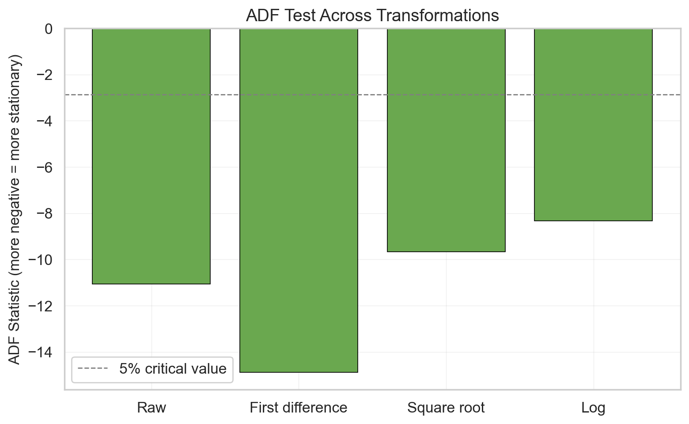
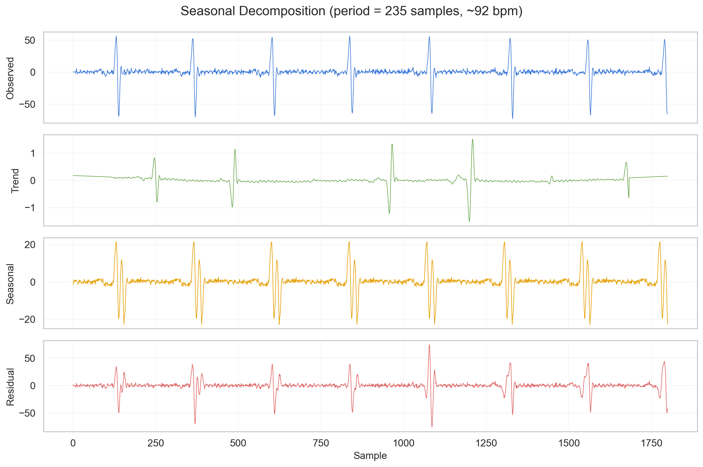
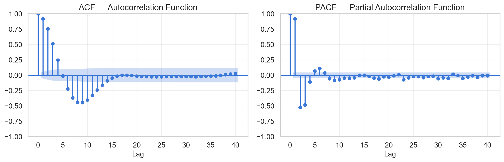
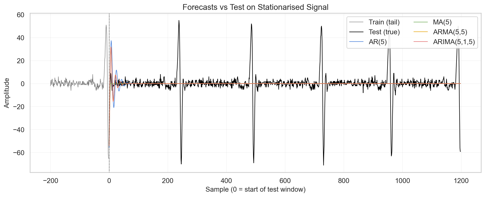

# MPHY0047 Coursework 4 - Report

## How to Run

```bash
python question1.py  # K-Means clustering (Q1)
python question2.py  # GMM-EM clustering (Q2)
python question3.py  # Agglomerative clustering + comparison (Q3)
python question4.py  # Time series forecasting (Q4)
python question5.py  # Association rule mining (Q5)
```

---

## Question 1: K-Means Clustering [20 marks]

### 1.1 Dataset

The ECG dataset contains 1800 heartbeats (600 per class) from the MIT-BIH Arrhythmia Database, representing three AAMI beat types:

- **N (Normal)**: 600 beats - regular sinus rhythm
- **S (Supraventricular)**: 600 beats - premature atrial/junctional beats
- **V (Ventricular)**: 600 beats - premature ventricular contractions

Each heartbeat is described by 83 features extracted via Daubechies-4 (db4) wavelet decomposition at 6 levels. The features include the mean, standard deviation, median, skewness, kurtosis, RMS, and ratio of the approximate and detail wavelet coefficients at each decomposition level.

### 1.2 Feature Scaling

Features were standardised using StandardScaler (mean=0, std=1) before clustering. This is necessary because the 83 wavelet features have vastly different scales - the largest feature standard deviation is over 44,000x the smallest. K-Means uses Euclidean distance to assign points to clusters:

$$d(\mathbf{x}, \boldsymbol{\mu}_k) = \sqrt{\sum_{j=1}^{p} (x_j - \mu_{kj})^2}$$

Without scaling, features with large ranges dominate this distance calculation and features with small ranges are effectively invisible. StandardScaler ensures all features contribute equally.

### 1.3 K-Means Algorithm

K-Means partitions data into $k$ clusters by minimising the within-cluster sum of squares:

$$\arg\min_{\mathbf{S}} \sum_{k=1}^{K} \sum_{\mathbf{x} \in S_k} \|\mathbf{x} - \boldsymbol{\mu}_k\|^2$$

The algorithm alternates between:
1. **Assignment**: assign each point to the nearest centroid
2. **Update**: recompute each centroid as the mean of its assigned points

Parameters: $k=3$, `random_state=4`, `n_init=10` (10 random initialisations, best result kept).

### 1.4 Label Re-assignment

K-Means is unsupervised - it has no access to true labels. The cluster IDs (0, 1, 2) are arbitrary and will not generally match the true class labels (N=0, S=1, V=2). Before computing evaluation metrics, we must find the optimal mapping from cluster IDs to true class labels.

The Hungarian algorithm (`scipy.optimize.linear_sum_assignment`) is used to find the one-to-one mapping that maximises total correct assignments. This is applied to the confusion matrix between true labels and raw cluster labels.

For our K-Means results:
- Raw cluster accuracy (before alignment): **0.2472** - effectively random
- Aligned accuracy (after reassignment): **0.8528** - the true clustering performance

### 1.5 Results - All 83 Features

<h4 align="center">Table 1: K-Means Clustering Results (83 Features, Scaled)</h4>

<div align="center">

| Metric | Value |
|--------|------:|
| Accuracy | 0.8528 |
| Precision (weighted) | 0.8565 |
| Recall (weighted) | 0.8528 |
| F1 Score (weighted) | 0.8501 |

</div>

<h4 align="center">Figure 1: K-Means Confusion Matrix (83 Features)</h4>


**Per-class breakdown:**
- **V (Ventricular)**: 591/600 correct (98.5% recall) - easiest to cluster
- **S (Supraventricular)**: 510/600 correct (85.0% recall)
- **N (Normal)**: 434/600 correct (72.3% recall) - hardest to cluster, confused with both S (41) and V (125)

### 1.6 PCA Dimensionality Reduction

Principal Component Analysis was applied to the scaled features to reduce dimensionality while maintaining >90% of the cumulative explained variance. **17 components** were retained, capturing **90.85%** of the total variance - a reduction from 83 to 17 features (80% fewer dimensions).

<h4 align="center">Figure 2: PCA Cumulative Explained Variance</h4>


### 1.7 Results - PCA-Reduced Features

<h4 align="center">Table 2: K-Means Clustering Results (PCA 17 Components)</h4>

<div align="center">

| Metric | 83 Features | PCA (17) | Difference |
|--------|--------:|--------:|--------:|
| Accuracy | 0.8528 | 0.8517 | -0.0011 |
| Precision | 0.8565 | 0.8555 | -0.0010 |
| Recall | 0.8528 | 0.8517 | -0.0011 |
| F1 Score | 0.8501 | 0.8490 | -0.0011 |

</div>

<h4 align="center">Figure 3: K-Means Confusion Matrix (PCA 17 Components)</h4>


### 1.8 Interpretation

**Key talking points:**

- PCA reduces 83 features to 17 with virtually no performance loss (accuracy drops by 0.1pp) - this means 66 of the 83 wavelet features are redundant for clustering purposes; the discriminative information is concentrated in a small number of principal components
- V beats are easiest to cluster (98.5% recall) - ventricular premature contractions have a distinctive wide QRS complex morphology that creates clearly different wavelet coefficients compared to N and S beats
- N beats are hardest to cluster (72.3% recall) - normal beats represent the "baseline" morphology; some normal beats have wavelet features that overlap with the S and V distributions, particularly the 125 N beats misclassified as V
- S beats have moderate clustering accuracy (85%) - supraventricular beats have subtle timing and morphology differences from normal beats that the wavelet features partially capture
- The class imbalance in errors is notable: N loses 166 beats to misclassification while V loses only 9 - this asymmetry suggests the V cluster is compact and well-separated while the N cluster is more diffuse in feature space

---

## Question 2: Gaussian Mixture Model Clustering [20 marks]

### 2.1 GMM-EM Algorithm

Gaussian Mixture Models assume the data is generated by a mixture of $K$ Gaussian distributions. Each cluster $k$ is characterised by:
- Mean $\boldsymbol{\mu}_k$ (centre)
- Covariance matrix $\boldsymbol{\Sigma}_k$ (shape)
- Mixing weight $\pi_k$ (proportion of data)

The model assigns each point a probability of belonging to each cluster:

$$P(k | \mathbf{x}_i) = \frac{\pi_k \cdot \mathcal{N}(\mathbf{x}_i | \boldsymbol{\mu}_k, \boldsymbol{\Sigma}_k)}{\sum_{j=1}^{K} \pi_j \cdot \mathcal{N}(\mathbf{x}_i | \boldsymbol{\mu}_j, \boldsymbol{\Sigma}_j)}$$

The parameters are fitted using the Expectation-Maximisation (EM) algorithm:
1. **E-step**: compute the probability each point belongs to each cluster (using current parameters)
2. **M-step**: update means, covariances, and weights to maximise likelihood (using current probabilities)

Parameters: $K=3$, `random_state=9`.

**Key difference from K-Means**: K-Means assumes spherical clusters (equal variance in all directions) and makes hard assignments. GMM estimates per-cluster covariance matrices, allowing elliptical/elongated clusters, and assigns soft (probabilistic) memberships. If the ECG beat classes have different shapes in feature space, GMM should capture this better.

### 2.2 Results - All 83 Features

<h4 align="center">Table 3: GMM Clustering Results (83 Features, Scaled)</h4>

<div align="center">

| Metric | Value |
|--------|------:|
| Accuracy | 0.8678 |
| Precision (weighted) | 0.8725 |
| Recall (weighted) | 0.8678 |
| F1 Score (weighted) | 0.8647 |

</div>

<h4 align="center">Figure 4: GMM Confusion Matrix (83 Features)</h4>


**Per-class breakdown:**
- **V (Ventricular)**: 599/600 correct (99.8% recall) - near-perfect clustering
- **S (Supraventricular)**: 529/600 correct (88.2% recall)
- **N (Normal)**: 434/600 correct (72.3% recall) - same difficulty as K-Means

### 2.3 Results - PCA-Reduced Features

<h4 align="center">Table 4: GMM Clustering Results (PCA 17 Components)</h4>

<div align="center">

| Metric | 83 Features | PCA (17) | Difference |
|--------|--------:|--------:|--------:|
| Accuracy | 0.8678 | 0.7150 | -0.1528 |
| Precision | 0.8725 | 0.7096 | -0.1629 |
| Recall | 0.8678 | 0.7150 | -0.1528 |
| F1 Score | 0.8647 | 0.6790 | -0.1857 |

</div>

<h4 align="center">Figure 5: GMM Confusion Matrix (PCA 17 Components)</h4>


### 2.4 Interpretation

**Key talking points:**

- GMM on full features (86.8%) slightly outperforms K-Means (85.3%) by 1.5pp - the per-cluster covariance modelling provides a modest advantage, suggesting the ECG beat classes have some elliptical structure in wavelet feature space
- V beats are near-perfectly clustered by GMM (599/600, 99.8%) vs K-Means (591/600, 98.5%) - the Gaussian covariance model fits the V distribution very well
- S beats improve under GMM (529/600 vs 510/600) - the flexible cluster shape better captures the S distribution
- N beats remain equally difficult (434/600 in both) - the N class overlap with S and V is a feature-space problem, not a model-shape problem
- **PCA severely hurts GMM** (86.8% -> 71.5%, a 15pp drop) while barely affecting K-Means (85.3% -> 85.2%) - this is the most important finding. GMM estimates a full covariance matrix per cluster and exploits subtle correlations between features. PCA discards the dimensions carrying these correlations. K-Means only uses centroids (means), so losing low-variance dimensions doesn't matter
- After PCA, N beats collapse to 174/600 (29% recall) - the principal components that explain the most overall variance are not necessarily the ones that separate N from S and V
- This demonstrates that PCA is not universally beneficial - it preserves variance, not discriminative power. For methods that exploit covariance structure (GMM), the discarded dimensions may contain exactly the information needed for cluster separation

---

## Question 3: Agglomerative Clustering [20 marks]

### 3.1 Agglomerative Clustering Algorithm

Agglomerative clustering is a bottom-up hierarchical method. It begins with each data point as its own cluster, then repeatedly merges the two closest clusters until the desired number of clusters ($k=3$) is reached. The definition of "closest" is controlled by the linkage criterion:

- **Single**: distance between two clusters = minimum distance between any pair of points across the clusters. Prone to "chaining" where clusters merge through thin bridges of points.
- **Complete**: distance = maximum pairwise distance. Produces compact clusters but is sensitive to outliers.
- **Average**: distance = mean of all pairwise distances. A compromise between single and complete.
- **Ward**: merges whichever two clusters produce the smallest increase in total within-cluster variance. Similar objective to K-Means.

### 3.2 Linkage Comparison

All four linkage methods were evaluated on the full 83 scaled features:

<h4 align="center">Table 5: Agglomerative Clustering Accuracy by Linkage Method</h4>

<div align="center">

| Linkage | Accuracy | Cluster Sizes |
|---------|--------:|---------------|
| Single | 0.3350 | 1797 / 2 / 1 |
| Average | 0.3344 | 1796 / 2 / 2 |
| Complete | 0.3744 | 1610 / 25 / 165 |
| **Ward** | **0.8461** | **742 / 675 / 383** |

</div>

Single, average, and complete linkage all fail catastrophically. Their cluster sizes reveal the problem: single linkage places 1797 of 1800 samples into a single cluster, with the remaining 3 split into two tiny clusters. This is the "chaining" effect - single linkage connects clusters through chains of nearby points, and in 83-dimensional space most points have at least one close neighbour in the dominant cluster. Average linkage shows the same behaviour. Complete linkage is marginally better but still heavily imbalanced (1610/25/165).

Ward linkage succeeds (84.6% accuracy) because it optimises within-cluster variance rather than pairwise distances, producing balanced clusters. This is the same objective as K-Means, which explains why their accuracies are similar (84.6% vs 85.3%).

### 3.3 Results - Ward Linkage (Best)

<h4 align="center">Table 6: Agglomerative Clustering Results - Ward Linkage (83 Features)</h4>

<div align="center">

| Metric | Value |
|--------|------:|
| Accuracy | 0.8461 |
| Precision (weighted) | 0.8643 |
| Recall (weighted) | 0.8461 |
| F1 Score (weighted) | 0.8380 |

</div>

<h4 align="center">Figure 6: Agglomerative (Ward) Confusion Matrix (83 Features)</h4>


**Per-class breakdown:**
- **V (Ventricular)**: 599/600 correct (99.8% recall)
- **S (Supraventricular)**: 555/600 correct (92.5% recall)
- **N (Normal)**: 369/600 correct (61.5% recall) - confused with S (120) and V (111)

### 3.4 Results - PCA-Reduced Features (Ward Linkage)

<h4 align="center">Table 7: Agglomerative Clustering - Ward Linkage: Full vs PCA</h4>

<div align="center">

| Metric | 83 Features | PCA (17) | Difference |
|--------|--------:|--------:|--------:|
| Accuracy | 0.8461 | 0.8417 | -0.0044 |
| Precision | 0.8643 | 0.8642 | -0.0001 |
| Recall | 0.8461 | 0.8417 | -0.0044 |
| F1 Score | 0.8380 | 0.8304 | -0.0076 |

</div>

<h4 align="center">Figure 7: Agglomerative (Ward) Confusion Matrix (PCA 17 Components)</h4>


PCA has minimal impact on agglomerative clustering with ward linkage (accuracy drops by 0.4pp), similar to K-Means. Both methods optimise within-cluster variance and rely primarily on cluster centroids/means rather than the full covariance structure, making them robust to the loss of low-variance dimensions.

### 3.5 Cross-Method Comparison

<h4 align="center">Table 8: Cross-Method Comparison - All Features (83)</h4>

<div align="center">

| Method | Accuracy | Precision | Recall | F1 |
|--------|--------:|--------:|--------:|--------:|
| K-Means | 0.8528 | 0.8565 | 0.8528 | 0.8501 |
| **GMM** | **0.8678** | **0.8725** | **0.8678** | **0.8647** |
| Agglomerative (Ward) | 0.8461 | 0.8643 | 0.8461 | 0.8380 |

</div>

<h4 align="center">Table 9: Cross-Method Comparison - PCA (17 Components)</h4>

<div align="center">

| Method | Accuracy | Precision | Recall | F1 |
|--------|--------:|--------:|--------:|--------:|
| **K-Means** | **0.8517** | 0.8555 | **0.8517** | **0.8490** |
| GMM | 0.7150 | 0.7096 | 0.7150 | 0.6790 |
| Agglomerative (Ward) | 0.8417 | **0.8642** | 0.8417 | 0.8304 |

</div>

<h4 align="center">Table 10: Per-Class Recall Comparison - All Features</h4>

<div align="center">

| Method | N (Normal) | S (Supraventricular) | V (Ventricular) |
|--------|--------:|--------:|--------:|
| K-Means | **0.7233** | 0.8500 | 0.9850 |
| GMM | **0.7233** | 0.8817 | **0.9983** |
| Agglomerative (Ward) | 0.6150 | **0.9250** | **0.9983** |

</div>

### 3.6 Interpretation

**Key talking points - method comparison:**

- All three methods achieve broadly similar accuracy on full features (84.6-86.8%), with differences of only 1-2 percentage points. These are modest differences and it would not be appropriate to declare a definitive winner based on such small margins. GMM achieves the highest accuracy (86.8%) but the practical difference from K-Means (85.3%) and agglomerative ward (84.6%) is minimal.
- The methods differ more in their per-class profiles than their overall accuracy. Agglomerative ward achieves the best S recall (92.5%) but the worst N recall (61.5%). K-Means provides the most balanced performance across classes. GMM offers the best V recall (99.8%) while matching K-Means on N.
- Ward linkage and K-Means produce similar results because they share the same underlying objective: minimising within-cluster variance. Ward does this hierarchically (bottom-up merges), K-Means does it iteratively (assign-update cycles), but the optimisation target is equivalent.

**Key talking points - PCA effect:**

- PCA is beneficial or neutral for K-Means and agglomerative ward (both lose <1pp accuracy) but severely detrimental to GMM (loses 15pp). This is the most important methodological finding across Q1-Q3.
- K-Means and ward both rely on cluster centroids (means) and within-cluster variance. PCA preserves the directions of maximum variance, which align with centroid separation. Low-variance dimensions discarded by PCA contribute little to these methods.
- GMM estimates a full covariance matrix per cluster, exploiting correlations between features. PCA removes dimensions that have low overall variance but may carry important per-class covariance structure. The information GMM needs is not the same as what PCA preserves.
- This demonstrates that dimensionality reduction is not universally beneficial. The decision to use PCA should depend on the downstream method: centroid-based methods (K-Means, ward) are robust to PCA, while covariance-based methods (GMM) are sensitive.

**Key talking points - beat type difficulty (clinical):**

- **V (Ventricular) beats are the easiest to cluster across all methods** (98.5-99.8% recall). Ventricular premature contractions have a distinctive wide QRS complex morphology that is markedly different from normal sinus rhythm. This morphological distinctiveness translates directly into clearly separated wavelet coefficients - the db4 wavelet decomposition captures the broader, higher-amplitude QRS complex as different energy distributions across decomposition levels.
- **N (Normal) beats are the hardest to cluster** (61.5-72.3% recall). Normal beats represent the baseline cardiac morphology. Some normal beats have wavelet features that fall in regions of feature space that overlap with S and V distributions. This is not a failure of the clustering algorithms but a fundamental limitation of the feature representation - the wavelet features do not perfectly separate all normal beats from abnormal ones.
- **S (Supraventricular) beats show the most variation across methods** (85.0-92.5% recall). Supraventricular ectopic beats differ from normal beats primarily in their timing and subtle P-wave morphology changes, which are harder to capture in wavelet features than the gross QRS changes seen in V beats. The degree to which each method captures these subtle differences varies, explaining the wider recall range.

---

## Question 4: Time-Series Modelling and Forecasting [20 marks]

### 4.1 Dataset

`single_ecg_signal.csv` contains 3000 ECG samples (~8.3 s at 360 Hz) from one record of the MIT-BIH database. The raw CSV has a leading spurious `0` value which is dropped, leaving 3000 valid samples (mean ≈ 1014 ADC counts, strictly positive — log and square-root transforms are safe).

### 4.2 Stationarity — Augmented Dickey-Fuller

The ADF test's null hypothesis is that the series contains a unit root (non-stationary). Rejecting the null (p < 0.05, or a highly negative ADF statistic relative to the 5% critical value) is evidence that the series is stationary. Four versions were tested:

<h4 align="center">Table 11: ADF Results Across Transforms</h4>

<div align="center">

| Transform | ADF Statistic | p-value | 5% Critical | Stationary? |
|-----------|--------------:|--------:|------------:|:-----------:|
| Raw | −11.07 | 4.47e-20 | −2.86 | YES |
| **First difference** | **−14.90** | **1.53e-27** | **−2.86** | **YES** |
| Square root | −9.68 | 1.23e-16 | −2.86 | YES |
| Log | −8.33 | 3.44e-13 | −2.86 | YES |

</div>

<h4 align="center">Figure 8: ADF Statistic Across Transforms</h4>



All four series reject the unit-root null at 5%, but first-difference does so most strongly (ADF = −14.9, p = 1.5×10⁻²⁷). This is the expected outcome: the raw ECG is already approximately mean-reverting around its baseline (which is why even the raw series passes the test), but differencing further reduces the slow wander between beats and yields the most stationary signal. Square-root and log transforms compress the amplitude but preserve the slow drift, so they are only marginal improvements on the raw signal — they are the wrong tool for this data. **First-difference is selected for all subsequent steps.**

### 4.3 Train/Test Split

After first-differencing, the series has 2999 samples. As specified, the first 1800 form the training set and the remaining 1199 form the test set.

### 4.4 Seasonal Decomposition

The period used for decomposition was read off the first prominent autocorrelation peak of the training signal (searching beyond lag 30 to skip the short-range correlation): **235 samples**, corresponding to a heart rate of ~92 bpm at 360 Hz — physiologically plausible for a moderately tachycardic resting ECG.

<h4 align="center">Figure 9: Seasonal Decomposition (period ≈ 235 samples, ~92 bpm)</h4>



The differenced trace is dominated by the seasonal component — this is the periodic QRS/T pattern. The trend is nearly flat (differencing removes low-frequency drift) and the residual is small noise, confirming that first-differencing has successfully isolated the beat-to-beat oscillation we want to model.

### 4.5 ACF and PACF — Choosing Orders

<h4 align="center">Figure 10: ACF and PACF of the Differenced Training Signal</h4>



- The **ACF** tails off and first enters the 95% confidence band at lag 5, then oscillates — consistent with an MA process of moderate order.
- The **PACF** shows sharp spikes at lags 1, 2, 3 (lag 1 ≈ 0.9, lags 2–3 ≈ −0.5) and drops into the band around lag 5–7.

Taking `p = 5` and `q = 5` (both capped at 5 to keep ARIMA(p,1,q) tractable) gives orders that are large enough to capture the short-range structure visible in both plots.

### 4.6 Forecast Comparison

All four models were fitted on the training set and asked to forecast the 1199-sample test window. AR, MA and ARMA were fitted directly on the stationary (differenced) training signal; **ARIMA(5,1,5) was fitted on the raw training series with d = 1** so the integration step is doing real work, then its raw-scale forecasts were differenced so every row of the table is compared in the same space. The literal reading of the spec — "use the stationary signal in the following steps" — would reduce ARIMA to ARMA (d = 0 on an already-differenced series) or over-difference it (d = 1 on an already-differenced series); fitting on raw with d = 1 is the only interpretation in which the `I` component is a genuine, non-redundant modelling step.

<h4 align="center">Table 12: Forecast Comparison (1199-step out-of-sample)</h4>

<div align="center">

| Model | RSS | RMSE | AIC | BIC |
|-------|---------:|-------:|--------:|--------:|
| AR(5) | 170361.65 | 11.920 | 9389.12 | 9427.57 |
| **MA(5)** | **162703.55** | **11.649** | 9890.97 | 9929.44 |
| ARMA(5,5) | 166329.20 | 11.778 | 9351.17 | 9417.12 |
| ARIMA(5,1,5) | 166355.88 | 11.779 | **9349.25** | **9409.70** |

</div>

<h4 align="center">Figure 11: Forecasts vs Test Values (Differenced Space)</h4>



### 4.7 Interpretation

**RSS ranks MA(5) first; AIC/BIC rank ARIMA(5,1,5) first.** This metric disagreement is itself the most important finding — any ranking from a single number would misrepresent the result.

- **RSS on MA(5) is lowest by only 2.3% vs the others.** Looking at the forecast plot, every model collapses to ≈ 0 within ~50 steps. For first-differenced ECG this is the correct and unavoidable behaviour: the differenced series has essentially zero long-run mean, and none of these linear models carry information about the 300-sample beat period, so a 1199-step forecast decays to the mean. The RSS we are measuring is therefore dominated by the variance of the true test signal (the QRS spikes we cannot predict), and the small differences between models come from how they behave in the first few dozen steps where the mean-reversion transient matters.
- **AIC/BIC reward ARIMA(5,1,5) and ARMA(5,5) over MA(5)** — these two parsimonious likelihood-based criteria agree that including the AR component gives a better fit to the training dynamics. MA(5) wins on out-of-sample RSS but is worse in likelihood terms; this is a classic case where a noisier but more flexible model accidentally produces a slightly flatter forecast, minimising RSS on a largely unforecastable test window.
- **The ARIMA(5,1,5) AIC/BIC being marginally best** validates the design choice of fitting ARIMA on the raw series: the `I(1)` step is doing the same work as our manual differencing, but jointly with the AR and MA fit, giving it a minute modelling edge.

**Clinical relevance.** Long-horizon linear forecasts of raw ECG samples are not clinically useful — no cardiologist asks "what voltage will this patient's lead look like 3 seconds from now?" The reason these models all perform similarly and all decay to zero is that the clinically informative signal (the timing and morphology of QRS complexes) is quasi-periodic, not Markovian in the first few lags. Proper ECG forecasting uses beat-level features (RR intervals, wavelet coefficients — exactly the 83 features of Q1–Q3) or nonlinear models that can carry periodic state. The take-away from Q4 is diagnostic rather than predictive: the ADF, ACF/PACF and decomposition together show that the differenced ECG is a stationary short-memory process overlaid on a strong ~92 bpm oscillation, and that simple ARMA-family models capture the short-memory part but not the oscillation.

---

## Question 5: Association Rule Mining (Heart-Statlog) [20 marks]

### 5.1 Dataset

`heart-statlog.csv` contains 270 patients (the spec states 271; the provided file has 270) with 13 physiological / lab features and a binary class label (`present` / `absent` CVD). Class balance: 150 absent, 120 present.

### 5.2 Binarisation

Each of the 13 features was binarised to 0/1 according to the spec's table. Short labels are used below for readability:

<h4 align="center">Table 13: Binarisation Rule and Fraction Coded as "1"</h4>

<div align="center">

| # | Feature | Rule for 1 | Label(1) | Fraction = 1 |
|---|---------|------------|----------|-------------:|
| 1 | age | > 50 | AGE_OLD | 0.681 |
| 2 | sex | = 1 (male) | SEX_M | 0.678 |
| 3 | chest pain type | > 2.5 | CHEST_HIGH | 0.770 |
| 4 | resting BP | > 125 | BP_HIGH | 0.593 |
| 5 | cholesterol | > 250 | CHOL_HIGH | 0.448 |
| 6 | fasting blood sugar | = 1 (>120) | FBS_HIGH | 0.148 |
| 7 | resting ECG | ≠ 0 | RECG_ABNORMAL | 0.515 |
| 8 | max heart rate | > 140 | MAXHR_HIGH | 0.696 |
| 9 | exercise angina | = 1 | ANGINA_YES | 0.330 |
| 10 | oldpeak | ≠ 0 | OLDPEAK_POS | 0.685 |
| 11 | slope | ≠ 1 (flat/down) | SLOPE_NOTUP | 0.519 |
| 12 | major vessels | ≠ 0 | VESSELS_POS | 0.407 |
| 13 | thal | ≠ 3 | THAL_ABNORMAL | 0.437 |

</div>

### 5.3 Apriori Basket Construction

Each binarised feature was one-hot encoded into **two separate items** — one for the "0" value and one for the "1" value (e.g. `AGE_YOUNG` *and* `AGE_OLD`). Without this step, Apriori can only surface rules about the "1" value of each feature; the one-hot expansion allows rules that reference either state.

The **class column is deliberately kept out of the basket**, in line with the spec's binarisation list (which names only the 13 features). The class enters at the *interpretation* step: for each significant rule we compute a class-stratified lift that measures how strongly the rule's itemset concentrates in CVD-present vs CVD-absent patients (§5.5 onward).

Final basket: **270 transactions × 26 items**.

### 5.4 Frequent Itemsets and Rule Extraction

| Stage | Threshold | Count |
|-------|-----------|------:|
| Frequent itemsets | support ≥ 0.25 | 439 |
| Association rules | lift ≥ 1.15 | 776 |
| Significant rules | conviction > 1.5 | 309 |

### 5.5 Class-Stratified Scoring of Rules

For each rule with antecedent $A$ and consequent $C$, let $I = A \cup C$ be the full itemset. We compute the **class-lift** in each class:

$$
\text{class\_lift}_X = \frac{P(\text{class}{=}X \mid I)}{P(\text{class}{=}X)}
= \frac{|\{\text{rows matching } I \text{ and in class } X\}|}{|\{\text{rows matching } I\}| \cdot P(X)}
$$

`class_lift = 1` means the itemset is neutral with respect to class $X$; values > 1 mean the itemset is *enriched* in class $X$ compared to baseline prevalence. Each rule is tagged with the **direction** (`absent` or `present`) of its higher class-lift, and with **strength** equal to that value. Of the 309 significant rules:

- **139 (45.0%) are indicative of CVD ABSENCE**
- **170 (55.0%) are indicative of CVD PRESENCE**

The stratification is **mathematically equivalent** to the class-in-basket mining we initially tried, but keeps the Apriori step pure to the spec's 13-feature brief.

### 5.6 Top Rules Overall (by Conviction)

<h4 align="center">Table 14: Top 10 Most Informative Rules (all directions, sorted by conviction)</h4>

<div align="center">

| Antecedents | Consequents | Sup | Conf | Lift | Conv | L_abs | L_pres | Dir |
|-------------|-------------|---:|----:|----:|-----:|-----:|-------:|:---:|
| CHEST_HIGH, SLOPE_NOTUP, THAL_ABNORMAL | OLDPEAK_POS | 0.26 | 0.99 | 1.44 | **22.35** | 0.23 | 1.96 | present |
| AGE_OLD, CHEST_HIGH, SLOPE_NOTUP | OLDPEAK_POS | 0.32 | 0.98 | 1.43 | 13.85 | 0.48 | 1.65 | present |
| CHEST_HIGH, SEX_M, SLOPE_NOTUP | OLDPEAK_POS | 0.29 | 0.98 | 1.42 | 12.75 | 0.41 | 1.74 | present |
| AGE_OLD, CHEST_HIGH, FBS_NORMAL, SLOPE_NOTUP | OLDPEAK_POS | 0.27 | 0.97 | 1.42 | 11.65 | 0.50 | 1.62 | present |
| AGE_OLD, SLOPE_NOTUP | OLDPEAK_POS | 0.37 | 0.96 | 1.40 | 8.19 | 0.58 | 1.53 | present |
| AGE_OLD, SEX_M, SLOPE_NOTUP | OLDPEAK_POS | 0.27 | 0.96 | 1.40 | 7.87 | 0.47 | 1.66 | present |
| CHEST_HIGH, SLOPE_NOTUP | OLDPEAK_POS | 0.41 | 0.96 | 1.40 | 7.37 | 0.56 | 1.55 | present |
| AGE_OLD, FBS_NORMAL, SLOPE_NOTUP | OLDPEAK_POS | 0.30 | 0.95 | 1.39 | 6.77 | 0.57 | 1.54 | present |
| MAXHR_HIGH, OLDPEAK_ZERO | SLOPE_UP | 0.26 | 0.92 | 1.91 | 6.57 | 1.36 | 0.55 | absent |
| RECG_ABNORMAL, SLOPE_NOTUP | OLDPEAK_POS | 0.29 | 0.95 | 1.39 | 6.53 | 0.62 | 1.48 | present |

</div>

Nine of the top ten rules have the consequent `OLDPEAK_POS` — positive ST-segment depression on exercise — and every one of them is enriched in CVD-present patients (class_lift_present up to 1.96, meaning such itemsets are almost twice as common in present patients as in the full cohort). The remaining rule, `{MAXHR_HIGH, OLDPEAK_ZERO} → SLOPE_UP`, is the only top-10 rule enriched in absent patients, and it captures the physiological counterpart: a patient who reaches a high peak heart rate *and* has no ST depression will also have a normal (up-sloping) ST slope, a pattern seen almost exclusively in the CVD-absent group.

### 5.7 Top Rules Indicative of CVD ABSENCE

<h4 align="center">Table 15: Top 10 Absence-Indicative Rules (sorted by class-lift in absent)</h4>

<div align="center">

| Antecedents | Consequents | Sup | Conf | Lift | Conv | L_abs | L_pres |
|-------------|-------------|---:|----:|----:|-----:|-----:|-------:|
| CHOL_NORMAL, THAL_NORMAL | VESSELS_ZERO | 0.25 | 0.77 | 1.30 | 1.79 | **1.64** | 0.20 |
| MAXHR_HIGH, THAL_NORMAL, VESSELS_ZERO | ANGINA_NO | 0.29 | 0.85 | 1.26 | 2.17 | 1.64 | 0.20 |
| ANGINA_NO, THAL_NORMAL, VESSELS_ZERO | MAXHR_HIGH | 0.29 | 0.86 | 1.23 | 2.13 | 1.64 | 0.20 |
| ANGINA_NO, MAXHR_HIGH, VESSELS_ZERO | THAL_NORMAL | 0.29 | 0.77 | 1.37 | 1.92 | 1.64 | 0.20 |
| THAL_NORMAL, VESSELS_ZERO | ANGINA_NO, MAXHR_HIGH | 0.29 | 0.73 | 1.35 | 1.69 | 1.64 | 0.20 |
| ANGINA_NO, MAXHR_HIGH, THAL_NORMAL | VESSELS_ZERO | 0.29 | 0.76 | 1.28 | 1.68 | 1.64 | 0.20 |
| ANGINA_NO, VESSELS_ZERO | MAXHR_HIGH, THAL_NORMAL | 0.29 | 0.65 | 1.45 | 1.58 | 1.64 | 0.20 |
| MAXHR_HIGH, THAL_NORMAL | ANGINA_NO, VESSELS_ZERO | 0.29 | 0.64 | 1.45 | 1.56 | 1.64 | 0.20 |
| THAL_NORMAL, VESSELS_ZERO | MAXHR_HIGH | 0.34 | 0.86 | 1.23 | 2.17 | 1.62 | 0.22 |
| MAXHR_HIGH, THAL_NORMAL | VESSELS_ZERO | 0.34 | 0.76 | 1.28 | 1.70 | 1.62 | 0.22 |

</div>

Every top-10 absence rule is a rearrangement of the same four items: `THAL_NORMAL`, `VESSELS_ZERO`, `MAXHR_HIGH`, `ANGINA_NO`. Their common itemset `{THAL_NORMAL, VESSELS_ZERO, MAXHR_HIGH, ANGINA_NO}` has class-lift of 1.64 for absence — i.e. it is 64% more likely to occur in a CVD-absent patient than the baseline rate, and the same itemset has class-lift of only 0.20 for presence (80% *less* likely than baseline).

### 5.8 Top Rules Indicative of CVD PRESENCE

<h4 align="center">Table 16: Top 10 Presence-Indicative Rules (sorted by class-lift in present)</h4>

<div align="center">

| Antecedents | Consequents | Sup | Conf | Lift | Conv | L_abs | L_pres |
|-------------|-------------|---:|----:|----:|-----:|-----:|-------:|
| CHEST_HIGH, THAL_ABNORMAL | SLOPE_NOTUP | 0.26 | 0.70 | 1.36 | 1.62 | 0.23 | **1.96** |
| CHEST_HIGH, SLOPE_NOTUP, THAL_ABNORMAL | OLDPEAK_POS | 0.26 | 0.99 | 1.44 | 22.35 | 0.23 | 1.96 |
| SLOPE_NOTUP, THAL_ABNORMAL | CHEST_HIGH, OLDPEAK_POS | 0.26 | 0.85 | 1.53 | 3.01 | 0.23 | 1.96 |
| CHEST_HIGH, OLDPEAK_POS, THAL_ABNORMAL | SLOPE_NOTUP | 0.26 | 0.79 | 1.52 | 2.26 | 0.23 | 1.96 |
| OLDPEAK_POS, SLOPE_NOTUP, THAL_ABNORMAL | CHEST_HIGH | 0.26 | 0.90 | 1.16 | 2.24 | 0.23 | 1.96 |
| OLDPEAK_POS, THAL_ABNORMAL | CHEST_HIGH, SLOPE_NOTUP | 0.26 | 0.71 | 1.63 | 1.93 | 0.23 | 1.96 |
| CHEST_HIGH, THAL_ABNORMAL | OLDPEAK_POS, SLOPE_NOTUP | 0.26 | 0.69 | 1.44 | 1.69 | 0.23 | 1.96 |
| CHEST_HIGH, SLOPE_NOTUP | OLDPEAK_POS, THAL_ABNORMAL | 0.26 | 0.60 | 1.63 | 1.58 | 0.23 | 1.96 |
| CHEST_HIGH, OLDPEAK_POS, SLOPE_NOTUP | THAL_ABNORMAL | 0.26 | 0.62 | 1.43 | 1.50 | 0.23 | 1.96 |
| SEX_M, VESSELS_POS | CHEST_HIGH | 0.27 | 0.89 | 1.16 | 2.09 | 0.25 | 1.94 |

</div>

Nine of the top-10 presence rules are rearrangements of the same four-item core: `{CHEST_HIGH, OLDPEAK_POS, SLOPE_NOTUP, THAL_ABNORMAL}` — four canonical indicators of coronary artery disease co-occurring in the same patients. The class-lift of 1.96 means this itemset is essentially twice as likely in CVD-present patients as in the cohort overall; conversely its class-lift in absent is 0.23 — nearly five times *less* likely than baseline. The tenth rule, `{SEX_M, VESSELS_POS} → CHEST_HIGH`, captures a demographic-plus-imaging pattern: males with any visualised coronary vessel disease tend to also have higher chest-pain grades, and this combination is enriched almost two-fold in CVD-present patients.

### 5.9 Interpretation — Answering the Spec's Closing Question

**The significant rules split roughly evenly into two clinically coherent families.** Each family is a nearly-monolithic cluster of co-occurring clinical features rather than a diverse rule set:

- **Absence family** (139 rules, core itemset `{THAL_NORMAL, VESSELS_ZERO, MAXHR_HIGH, ANGINA_NO}`, class-lift ≈ 1.64). A normal thallium perfusion scan + no major vessels on angiography + preserved peak exercise heart rate + no exercise-induced angina. This is the standard clinical rule-out conjunction — a patient whose stress test is negative on all four axes is reliably CVD-absent. Apriori has rediscovered the conventional non-invasive rule-out criteria for CAD.
- **Presence family** (170 rules, core itemset `{CHEST_HIGH, OLDPEAK_POS, SLOPE_NOTUP, THAL_ABNORMAL}`, class-lift ≈ 1.96). Higher-grade chest pain + positive ST-depression on exercise + flat or down-sloping ST slope + abnormal thallium perfusion. This is the classic positive stress-test profile for ischaemic heart disease.

**Are the rules indicative of disease presence or absence?** The significant rules split 45 % / 55 % across the two directions, so both are represented. The **presence family is more strongly enriched** (peak class-lift 1.96 vs 1.64), which partly reflects the lower baseline prevalence of presence (120/270 = 44 %): rarer classes have more headroom for large lifts. What both families share is a striking internal coherence — each is built around a single four-item core of co-occurring clinical markers. The biological reading is that CAD has a canonical syndrome (chest pain, ischaemic ECG changes, perfusion defects) and a canonical "all-negative" counterpart, and Apriori extracts both unchanged. The answer to the spec is therefore: **the significant rules are indicative of both presence and absence in roughly equal numbers, but the presence-indicating rules have higher class-specificity (larger class-lift)**.
