# MPHY0047 Coursework 1 - Report

## How to Run

To execute all analysis scripts and generate figures (This report assumes the sds environment is used):

```bash
python run_all_scripts.py
```

Or run individual questions:
```bash
python question1.py  # Descriptive statistics + 12 figures
python question2.py  # Statistical testing (time parameters)
python question3.py  # Error analysis
python question4.py  # Fixation sparsity analysis
python question5.py  # Metric ranking
```

---

## Question 1: Descriptive Statistics [15 marks]

### 1.1 Summary Statistics

#### Table 1: Descriptive Statistics for Time Parameters (Seconds)

| Group | Parameter | Mean | Median | Variance | Skewness | Kurtosis |
|-------|-----------|------|--------|----------|----------|----------|
| Experts | Total Duration | 65.12 | 70.12 | 140.87 | -0.2817 | 1.8171 |
| Experts | Needle Passing | 21.80 | 19.04 | 37.07 | 1.0776 | 2.8638 |
| Experts | Knot Tying | 12.40 | 12.68 | 17.44 | 0.2283 | 2.1490 |
| Novices | Total Duration | 107.07 | 98.08 | 1162.93 | 1.1176 | 4.0217 |
| Novices | Needle Passing | 34.27 | 30.12 | 283.64 | 1.4997 | 4.8031 |
| Novices | Knot Tying | 21.37 | 16.44 | 70.57 | 0.9840 | 2.7558 |

The above table shows the results for the descriptive statistics taken for the time taken for tasks to be completed by novices and experts. It shows the novices consistently have higher median and mean values across all statistics indicating that their lack of experience requires them to complete tasks at a slower pace; this could also be a result of them making errors along the way. Novices also exhibit greater variance, suggesting that on some attempts the novices are able to complete the task much faster; possibly due to luck or an absence of errors; alternatively this could be the result of outliers (i.e., one novice being particularly skilled). Finally, the positive skewness of the novice data sugests a right-tailed distribution, with some participants taking considerably longer.

### 1.2 Histograms and Boxplots

Twelve figures were generated as a requirement of question 1:

#### Total Duration

| | Experts | Novices |
|:-:|:-:|:-:|
| **Histogram** | 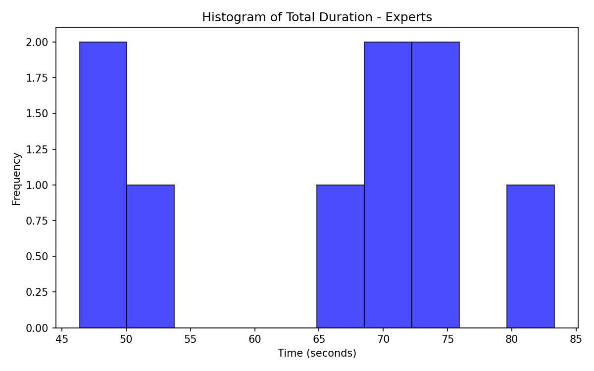 |  |
| **Boxplot** | 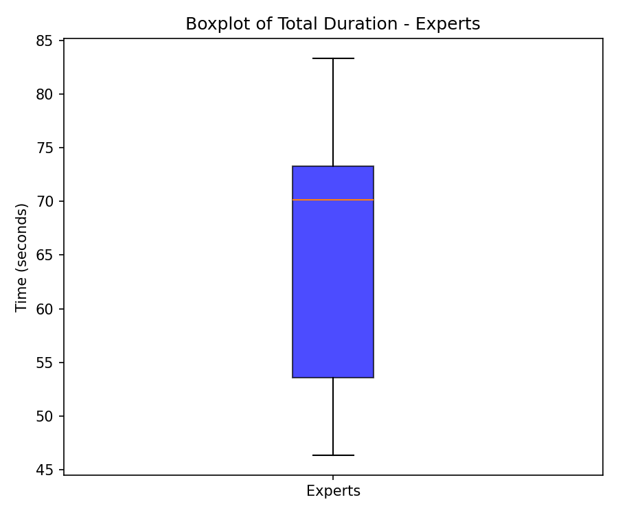 | 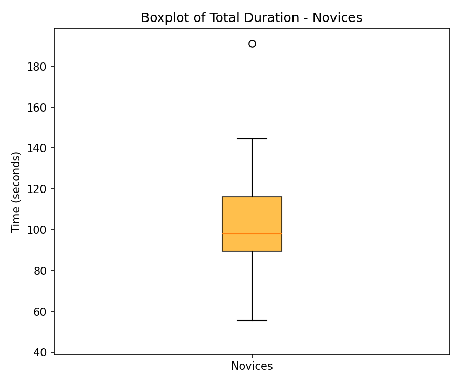 |

#### Needle Passing

| | Experts | Novices |
|:-:|:-:|:-:|
| **Histogram** | 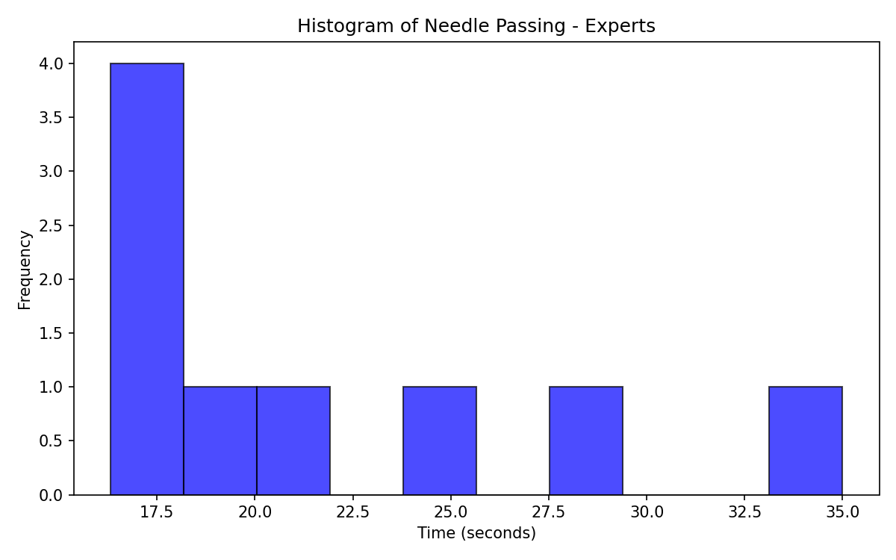 | 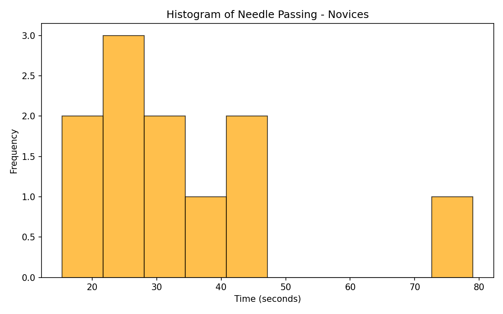 |
| **Boxplot** | 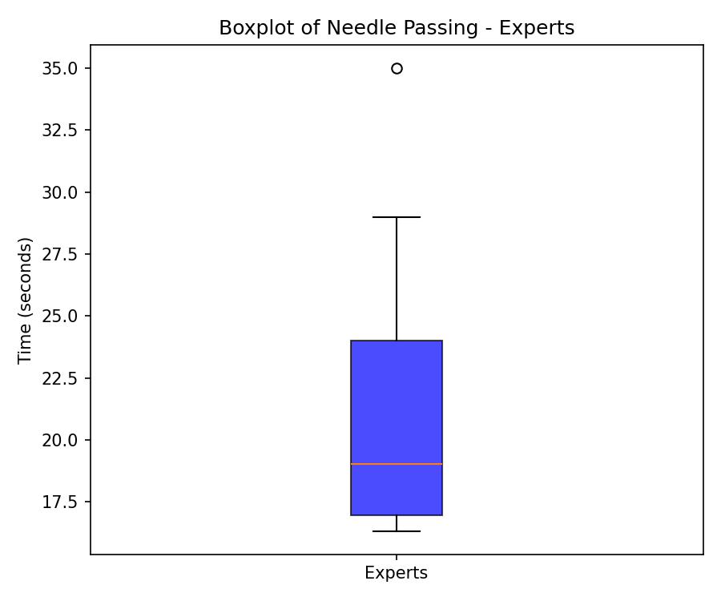 | 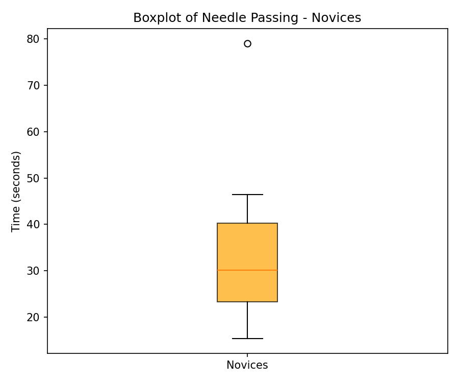 |

#### Knot Tying

| | Experts | Novices |
|:-:|:-:|:-:|
| **Histogram** | 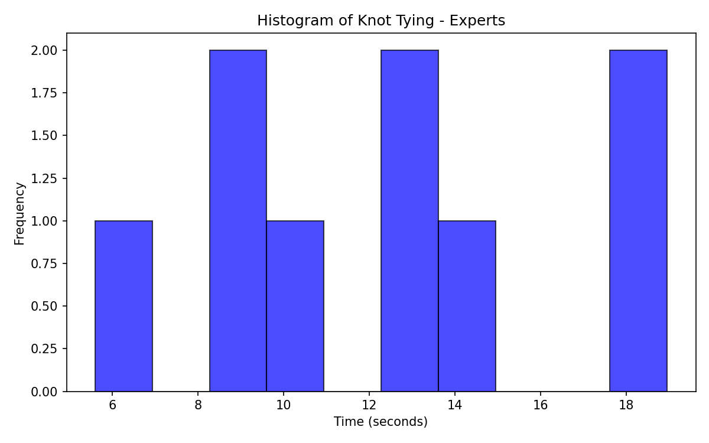 | 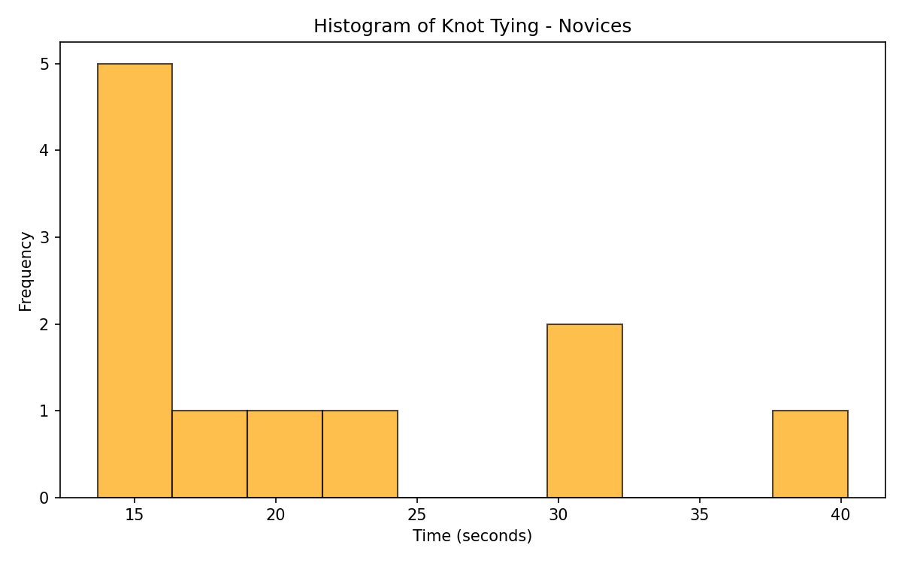 |
| **Boxplot** | 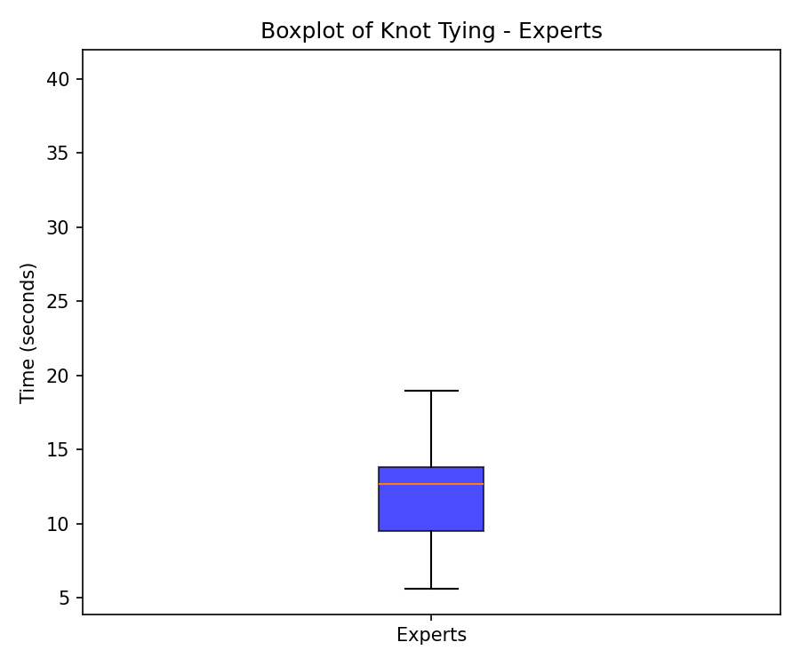 | 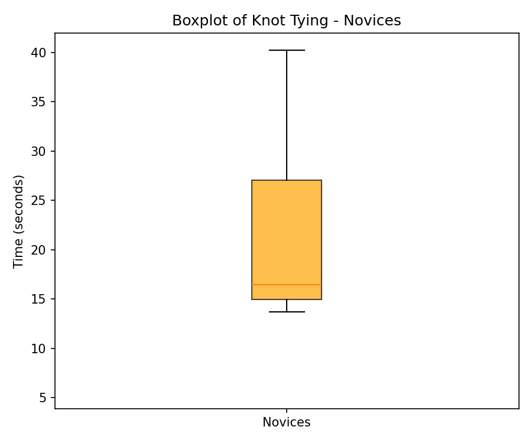 |

The plots visually confirm that novice distributions are shifted toward higher values with greater spread compared to experts. The boxplots are especially useful in showing these distributions, where experts are consistently better at the task, while also remaining a tighter distribution - suggestive of both a lack of errors and lots of experience.

### 1.3 Outlier Identification

Outliers were identified using the IQR method: values below Q1 - 1.5*IQR or above Q3 + 1.5*IQR.

#### Table 2: Outlier Analysis

| Group | Parameter | Q1 | Q3 | IQR | Lower Bound | Upper Bound | Outliers |
|-------|-----------|-----|-----|-----|-------------|-------------|----------|
| Experts | Total Duration | 53.56 | 73.28 | 19.72 | 23.98 | 102.86 | None |
| Experts | Needle Passing | 16.96 | 24.00 | 7.04 | 6.40 | 34.56 | **35.0** |
| Experts | Knot Tying | 9.52 | 13.80 | 4.28 | 3.10 | 20.22 | None |
| Novices | Total Duration | 89.40 | 116.28 | 26.88 | 49.08 | 156.60 | **191.28** |
| Novices | Needle Passing | 23.34 | 40.26 | 16.92 | -2.04 | 65.64 | **79.04** |
| Novices | Knot Tying | 14.92 | 27.04 | 12.12 | -3.26 | 45.22 | None |

**Observations:**
- 3 outliers identified across all datasets
- Needle Passing shows outliers in both groups
- Novice Total Duration has one extreme outlier (191.28 sec)

### 1.4 Robustness Analysis

Robustness was assessed using the Coefficient of Variation (CV = Standard Deviation / Mean). Lower CV indicates more consistent measurements.

#### Table 3: Coefficient of Variation Analysis

| Parameter | Expert CV | Novice CV | Combined CV |
|-----------|-----------|-----------|-------------|
| Total Duration | 18.2% | 31.8% | **38.3%** |
| Needle Passing | 27.9% | 49.1% | 50.7% |
| Knot Tying | 33.7% | 39.3% | 47.1% |

**Conclusion on Robustness:**
- **Most robust parameter: Total Duration** (CV = 38.3%)
- **Least robust parameter: Needle Passing** (CV = 50.7%)

Total Duration presents the smallest relative dispersion, making it the most reliable metric for comparing performance between groups. Needle Passing shows the highest variability, particularly among novices (49.1%), suggesting this subtask is most sensitive to individual differences in skill level.

---

## Question 2: Statistical Testing of Time Parameters [25 marks]

### 2.1 Test Selection Justification

**Selected Test: Mann-Whitney U Test (Wilcoxon rank-sum test)**

**Rationale:**
1. **Sample size**: Small samples (n=9 experts, n=11 novices) limit the reliability of parametric assumptions
2. **Normality violations**: Shapiro-Wilk tests revealed non-normal distributions for several parameters (see Table 4)
3. **Non-parametric robustness**: Mann-Whitney U does not assume normality and is appropriate for comparing two independent groups

### 2.2 Normality Testing

#### Table 4: Shapiro-Wilk Normality Test Results (alpha = 0.05)

| Group | Parameter | W-statistic | p-value | Normal? |
|-------|-----------|-------------|---------|---------|
| Experts | Total Duration | 0.9277 | 0.4593 | Yes |
| Novices | Total Duration | 0.8862 | 0.1244 | Yes |
| Experts | Needle Passing | 0.8338 | 0.0492 | **No** |
| Novices | Needle Passing | 0.8463 | 0.0382 | **No** |
| Experts | Knot Tying | 0.9455 | 0.6406 | Yes |
| Novices | Knot Tying | 0.8338 | 0.0262 | **No** |

Three of six datasets violate normality assumptions, justifying the use of non-parametric testing.

### 2.3 Homogeneity of Variance

#### Table 5: Levene's Test for Equality of Variances (alpha = 0.05)

| Parameter | Levene Statistic | p-value | Equal Variance? |
|-----------|------------------|---------|-----------------|
| Total Duration | 1.9007 | 0.1849 | Yes |
| Needle Passing | 2.4074 | 0.1382 | Yes |
| Knot Tying | 1.5189 | 0.2336 | Yes |

While variances are homogeneous, the normality violations still warrant non-parametric testing.

### 2.4 Statistical Test Results

#### Table 6: Mann-Whitney U Test Results (alpha = 0.05)

| Parameter | Expert Median (IQR) | Novice Median (IQR) | U | p-value | Cohen's d | Significant? |
|-----------|---------------------|---------------------|---|---------|-----------|--------------|
| Total Duration | 70.1 (53.6-73.3) | 98.1 (89.4-116.3) | 6.0 | **0.0011** | -1.56 | **Yes** |
| Needle Passing | 19.0 (17.0-24.0) | 30.1 (23.3-40.3) | 22.0 | **0.0402** | -0.94 | **Yes** |
| Knot Tying | 12.7 (9.5-13.8) | 16.4 (14.9-27.0) | 13.0 | **0.0062** | -1.29 | **Yes** |

#### Figure 13: Total Duration - Experts vs Novices

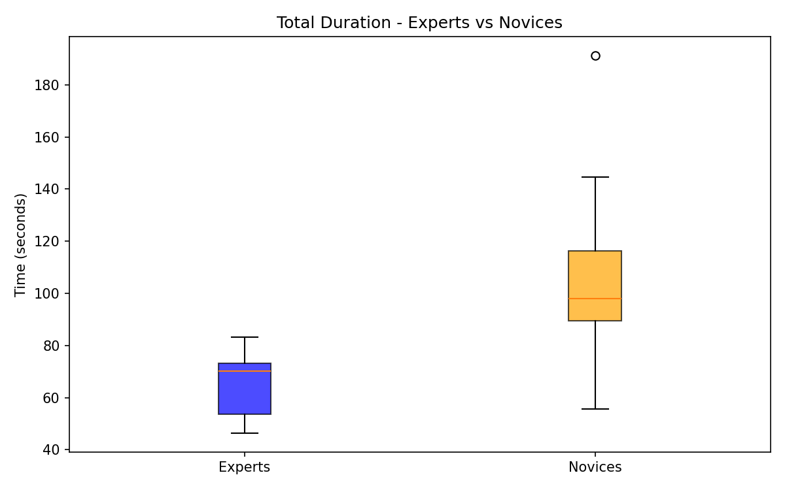

#### Figure 14: Needle Passing - Experts vs Novices

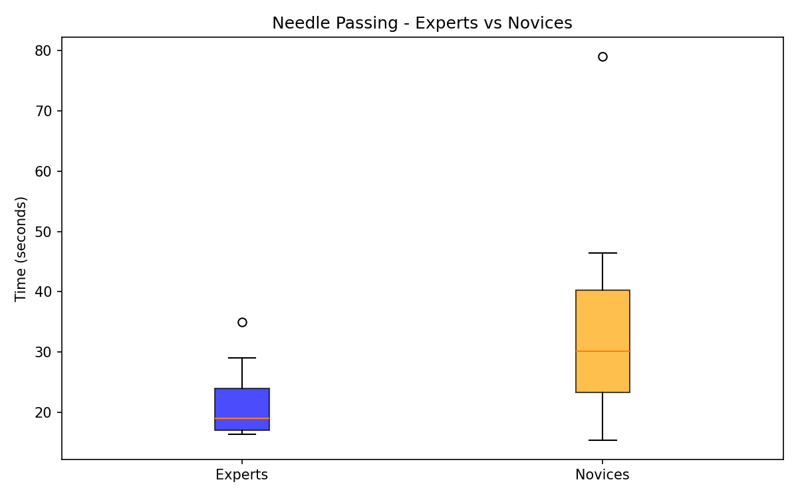

#### Figure 15: Knot Tying - Experts vs Novices

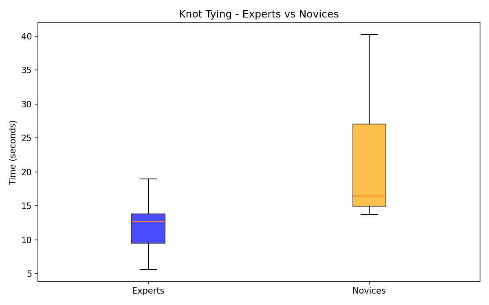

*All three parameters show clear separation between groups, with novices exhibiting higher values and greater variability.*

### 2.5 Effect Size Interpretation

| Cohen's d | Magnitude |
|-----------|-----------|
| -1.56 (Total Duration) | **Large** |
| -0.94 (Needle Passing) | **Large** |
| -1.29 (Knot Tying) | **Large** |

### 2.6 Interpretation of Results

**All three time parameters show statistically significant differences between experts and novices (p < 0.05).**

1. **Total Duration** (p = 0.0011, d = -1.56): Experts complete the entire task significantly faster than novices. The large effect size indicates a substantial practical difference.

2. **Needle Passing** (p = 0.0402, d = -0.94): Experts are significantly faster at needle passing. This has the smallest effect among the three parameters but remains practically significant.

3. **Knot Tying** (p = 0.0062, d = -1.29): Experts tie knots significantly faster. The large effect size suggests this is a key differentiator of surgical skill.

The negative Cohen's d values indicate experts have lower (faster) times compared to novices.

---

## Question 3: Error Analysis [25 marks]

### 3.1 Error Annotation Rules

Following the coursework specification, errors were counted based on deviations from the ideal sequence (1-3-4-4-(4)-5):

| Rule | Condition | Error Added |
|------|-----------|-------------|
| 1 | S2 (disentangling threads) present | +1 |
| 2 | S3 (picking appropriate instruments) absent | +1 |
| 3 | S5 (suture cutting) absent | +1 |
| 4 | Less than 2 S4 (knot tying) gestures | +1 |

### 3.2 Error Counts by Participant

#### Table 7: Expert Error Analysis (n=9)

| ID | Gesture Sequence | Error Count | Reasons |
|----|------------------|-------------|---------|
| 21 | [1, 2, 3, 4, 4, 5] | 1 | S2 present |
| 24 | [1, 3, 4, 4, 4, 5] | 0 | None |
| 76 | [1, 4, 4, 4, 5] | 1 | S3 absent |
| 20 | [1, 4, 4, 4, 5] | 1 | S3 absent |
| 6 | [1, 4, 4, 4, 5] | 1 | S3 absent |
| 23 | [1, 3, 4, 4, 5] | 0 | None |
| 57 | [1, 4, 4, 4, 5] | 1 | S3 absent |
| 64 | [1, 4, 4, 4, 5] | 1 | S3 absent |
| 75 | [1, 2, 4, 4, 5] | 2 | S2 present, S3 absent |

#### Table 8: Novice Error Analysis (n=11)

| ID | Gesture Sequence | Error Count | Reasons |
|----|------------------|-------------|---------|
| 33 | [1, 3, 4, 4, 4, 5] | 0 | None |
| 26 | [1, 3, 4, 4, 4, 5] | 0 | None |
| 48 | [1, 4, 4, 4, 5] | 1 | S3 absent |
| 34 | [1, 2, 4, 4, 4, 5] | 2 | S2 present, S3 absent |
| 44 | [1, 4, 4, 4, 5] | 1 | S3 absent |
| 63 | [1, 3, 4, 4, 4, 5] | 0 | None |
| 16 | [1, 4, 4, 4, 5] | 1 | S3 absent |
| 18 | [1, 2, 4, 4, 5] | 2 | S2 present, S3 absent |
| 19 | [1, 4, 4, 4, 5] | 1 | S3 absent |
| 25 | [1, 4, 4, 4, 5] | 1 | S3 absent |
| 53 | [1, 3, 4, 4, 4, 5] | 0 | None |

#### Figure 16: Error Metric - Experts vs Novices


*Both groups show similar distributions of error counts, with median values of 1.0.*

### 3.3 Descriptive Statistics

#### Table 9: Error Metric Descriptive Statistics

| Group | Mean | Median | Variance | Std Dev |
|-------|------|--------|----------|---------|
| Experts | 0.89 | 1.0 | 0.32 | 0.57 |
| Novices | 0.82 | 1.0 | 0.51 | 0.72 |

### 3.4 Test Selection Justification

**Selected Test: Mann-Whitney U Test**

**Rationale:**
1. **Discrete count data**: Error counts are discrete integers (0, 1, 2, ...), not continuous measurements
2. **Non-normal distributions**: Shapiro-Wilk tests indicate non-normality (Experts: p = 0.0122; Novices: p = 0.0183)
3. **Small sample sizes**: n=9 experts, n=11 novices
4. **Ordinal nature**: Error counts represent ordinal levels of performance deviation

### 3.5 Normality Testing

#### Table 10: Shapiro-Wilk Normality Test for Error Metric

| Group | W-statistic | p-value | Normal? |
|-------|-------------|---------|---------|
| Experts | 0.7805 | 0.0122 | **No** |
| Novices | 0.8219 | 0.0183 | **No** |

Both groups violate normality assumptions, confirming the appropriateness of non-parametric testing.

### 3.6 Statistical Test Results

#### Table 11: Mann-Whitney U Test Results for Error Metric

| Metric | Expert Median (IQR) | Novice Median (IQR) | U | p-value | Cohen's d | Significant? |
|--------|---------------------|---------------------|---|---------|-----------|--------------|
| Error Count | 1.0 (1.0-1.0) | 1.0 (0.0-1.0) | 53.0 | 0.7995 | 0.10 | **No** |

### 3.7 Interpretation of Results

**The error metric does NOT show a statistically significant difference between experts and novices (p = 0.7995).**

**Key findings:**
1. **Similar error rates**: Both groups have median error counts of 1.0, indicating comparable procedural adherence
2. **Negligible effect size**: Cohen's d = 0.10 indicates a negligible practical difference
3. **Common error pattern**: The most frequent error in both groups is S3 absent (skipping instrument selection), occurring in 7/9 experts and 6/11 novices

**Possible explanations:**
- The task environment (training board rather than live surgery) may allow shortcuts without consequence
- The error metric captures procedural deviations but not execution quality
- Both groups received pre-task education, potentially standardizing procedural knowledge
- Time-based metrics may be more sensitive discriminators of expertise than error counts in this context

---

## Question 4: Fixation Sparsity Analysis [25 marks]

### 4.1 Fixation Sparsity Metric

Fixation sparsity quantifies the spatial distribution of gaze fixations during the knot tying phase:

**Fixation Sparsity = (Number of non-white pixels) / (Total pixels)**

Where total pixels = 1920 x 1080 = 2,073,600 (image resolution)

Higher sparsity indicates more dispersed gaze patterns; lower sparsity indicates more focused attention.

#### Example Fixation Heatmaps

The heatmaps below illustrate the difference in gaze distribution between an expert and a novice participant. Warmer colours signify higher fixation concentration.

| Expert (ID 24) | Novice (ID 34) |
|:-:|:-:|
|  |  |

*The expert shows a tightly concentrated fixation pattern, while the novice exhibits a more dispersed gaze across the visual field.*

### 4.2 Descriptive Statistics

#### Table 12: Fixation Sparsity Descriptive Statistics

| Group | Mean | Median | Variance | Std Dev | IQR |
|-------|------|--------|----------|---------|-----|
| Experts | 0.0344 (3.44%) | 0.0362 | 5.91e-05 | 0.0077 | 0.0276-0.0378 |
| Novices | 0.0523 (5.23%) | 0.0516 | 1.77e-04 | 0.0133 | 0.0474-0.0626 |

**Key observations:**
- Novices show approximately 50% higher fixation sparsity than experts
- Novices exhibit greater variance in sparsity values
- Expert fixations are more concentrated (lower sparsity = more focused gaze)

### 4.3 Test Selection Justification

**Selected Test: Independent t-test**

**Rationale (data-driven selection):**
1. **Normality satisfied**: Shapiro-Wilk tests confirm both groups are normally distributed
   - Experts: W = 0.9581, p = 0.7784 (Normal)
   - Novices: W = 0.9161, p = 0.2871 (Normal)
2. **Equal variances**: Levene's test confirms homogeneity of variance
   - Levene statistic = 1.7561, p = 0.2017 (Equal variance)
3. **Continuous ratio data**: Sparsity is a continuous measure between 0 and 1

Unlike Questions 2 and 3 where normality violations necessitated non-parametric testing, the fixation sparsity data meets parametric assumptions, allowing use of the more powerful t-test.

### 4.4 Statistical Test Results

#### Table 13: Independent t-test Results for Fixation Sparsity

| Metric | Expert Median (IQR) | Novice Median (IQR) | t | p-value | Cohen's d | Significant? |
|--------|---------------------|---------------------|---|---------|-----------|--------------|
| Fixation Sparsity | 0.0362 (0.0276-0.0378) | 0.0516 (0.0474-0.0626) | -3.41 | **0.0031** | -1.57 | **Yes** |

#### Figure 17: Fixation Sparsity - Experts vs Novices

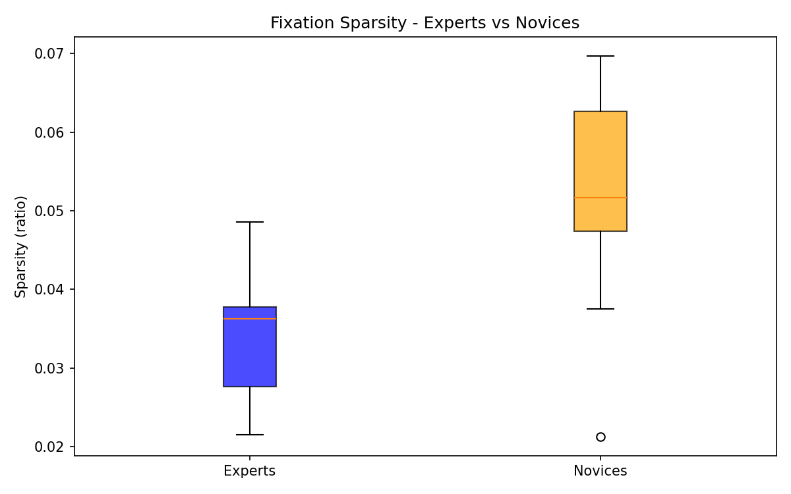

*Experts show significantly lower sparsity (more focused gaze) compared to novices.*

### 4.5 Interpretation of Results

**Fixation sparsity shows a statistically significant difference between experts and novices (p = 0.0031).**

**Key findings:**
1. **Large effect size**: Cohen's d = -1.57 indicates a substantial practical difference
2. **Experts show focused gaze**: Lower sparsity (3.6%) reflects concentrated visual attention on task-relevant areas
3. **Novices show scattered gaze**: Higher sparsity (5.2%) indicates more dispersed fixation patterns across the visual field

**Clinical interpretation:**
- Experts demonstrate more efficient visual search strategies, focusing attention on critical task elements
- Novices exhibit exploratory gaze behaviour, potentially indicating uncertainty or less developed mental models of the task
- This aligns with eye-tracking research showing experts fixate on regions of interest before performing actions [3]

---

## Question 5: Metric Ranking for Discrimination [10 marks]

### 5.1 Ranking Criteria

Metrics are ranked by their ability to discriminate between expert and novice surgeons based on:
1. **Statistical significance** (p-value < 0.05)
2. **Effect size magnitude** (|Cohen's d|)
3. **Practical interpretability**

### 5.2 Summary of All Metrics

#### Table 14: Comprehensive Metric Comparison

| Rank | Metric | p-value | Cohen's d | Effect Size | Significant? |
|------|--------|---------|-----------|-------------|--------------|
| 1 | **Fixation Sparsity** | 0.0031 | -1.57 | Large | Yes |
| 2 | **Total Duration** | 0.0011 | -1.56 | Large | Yes |
| 3 | **Knot Tying Time** | 0.0062 | -1.29 | Large | Yes |
| 4 | **Needle Passing Time** | 0.0402 | -0.94 | Large | Yes |
| 5 | **Error Metric** | 0.7995 | 0.10 | Negligible | No |

#### Figure 18: Effect Size Comparison Across All Metrics

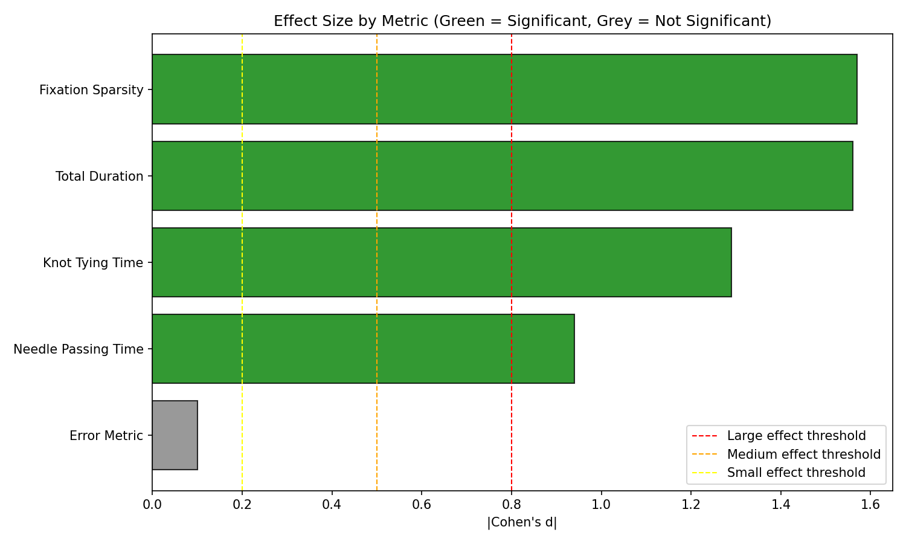

*Green bars indicate statistically significant metrics (p < 0.05); grey bars indicate non-significant. Dashed lines show conventional effect size thresholds.*

### 5.3 Ranking Justification

**1. Fixation Sparsity (Best Discriminator)**
- Highest effect size (|d| = 1.57) and highly significant (p = 0.0031)
- Captures cognitive differences in visual attention strategy
- Parametric assumptions satisfied, providing robust statistical inference
- Directly measures gaze behaviour differences between expertise levels

**2. Total Duration**
- Comparable effect size (|d| = 1.56) with lowest p-value (0.0011)
- Most robust time parameter (lowest CV = 38.3% from Q1)
- Holistic measure capturing overall task performance
- Ranked second due to slightly lower effect size than fixation sparsity

**3. Knot Tying Time**
- Large effect size (|d| = 1.29) with strong significance (p = 0.0062)
- Measures core surgical skill directly
- More specific than total duration but less discriminating

**4. Needle Passing Time**
- Large effect size (|d| = 0.94) but borderline significance (p = 0.0402)
- Highest variability among time parameters (CV = 50.7%)
- Less reliable discriminator due to high within-group variation

**5. Error Metric (Poorest Discriminator)**
- Not statistically significant (p = 0.7995)
- Negligible effect size (|d| = 0.10)
- Both groups show similar procedural adherence
- Does not capture execution quality, only sequence deviations

### 5.4 Conclusions

**Primary finding:** Eye-tracking derived metrics (fixation sparsity) and time-based metrics effectively discriminate between expert and novice ophthalmic surgeons, while procedural error counts do not.

**Recommendations for skill assessment:**
1. **Fixation sparsity** should be prioritized as a cognitive marker of expertise
2. **Total duration** provides a reliable, easy-to-measure performance indicator
3. **Error metrics** require refinement to capture execution quality, not just procedural deviations

**Clinical implications:**
- Training programmes could use gaze pattern analysis to provide targeted feedback
- Time-based metrics offer practical assessment tools without specialized equipment
- Procedural knowledge appears well-established across experience levels; skill differences manifest in execution efficiency and visual attention

---

## Summary

| Question | Key Finding |
|----------|-------------|
| Q1 | Total Duration is the most robust parameter (CV = 38.3%); several outliers identified in needle passing |
| Q2 | All three time parameters significantly differentiate experts from novices (p < 0.05) with large effect sizes |
| Q3 | Error metric shows no significant difference between groups (p = 0.7995) |
| Q4 | Fixation sparsity significantly differentiates groups (p = 0.0031) with large effect size (d = -1.57) |
| Q5 | Ranking: Fixation Sparsity > Total Duration > Knot Tying > Needle Passing > Error Metric |

The eye-tracking and time-based metrics prove to be effective discriminators of surgical expertise for the knot tying task, while the error metric based on procedural sequence deviations does not distinguish between experience levels. Fixation sparsity emerges as the strongest discriminator, capturing fundamental differences in how experts and novices visually attend to the surgical task.
